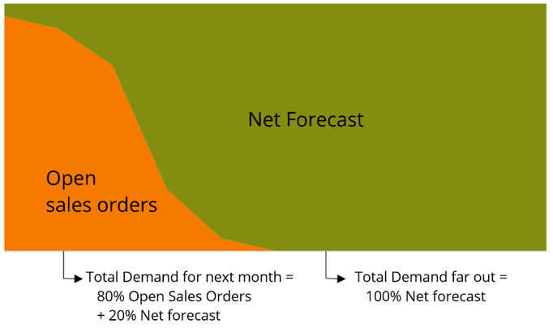

====================================
Forecast consumption by sales orders
====================================

Forecast consumption reconciles sales orders and sales forecast in a complete and
consistent demand picture that covers the complete horizon.

| Short term demand consists primarily of customer sales orders.
| Longer term demand consists primarily of sales forecast. 
| In the time period where both forecast and sales orders exist, the forecast 
  consumption logic reconciles both.

   
A simple example illustrates the concept:

  - Consider a situation for a forecast bucket with:
      
      - Total forecasted demand of 100 units

      - Sales orders already received of 20 units

  - The "net forecast", ie sales orders still expected to be received, for 
    this example is: 100 - 20 = 80 units.
    
  - | For the supply planning we will consider the sales orders (= 20) plus the
      net forecast (= 80).
    | As long as the orders come in as forecasted the total supply we plan for
      will remain stable at 100 units.
    | When orders exceed the forecast for a certain bucket, we will plan for
      this total and the total supply we plan for will now increase. More 
      advanced policies where we consume from multiple forecast buckets can also
      be configured.

Using this forecast consumption logic we have a consistent and complete demand 
picture across the complete planning horizon. For each part of the plan frePPLe
keeps the link with the end item demand, so we know exactly when we producing
based on a forecast or a sales order.
 
