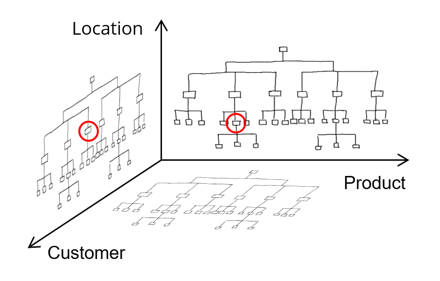

==============
Sales forecast
==============

A sales forecast requires input of different department of a company: sales, 
marketing, top management, production, product development... 
They should efficiently work together on the same set of numbers.   

Establishing a sales forecast is more of a collaboration process, with a
multi-dimensional analysis of the expected sales rather than running an 
advanced mathematical model.

- A sales manager reviews the forecast for his region

- An account manager reviews the forecast for his customers

- A product manager reviews forecast for a product range

- The general manager reviews the overall forecasted sales value

The accuracy of the forecast will significantly go down as we look further 
in the future. This should not prevent you from generating a forecast - it's
better to have a plan with the best information we have available now than 
to have no plan at all. As time passes, the forecast and the resulting plan 
will change substantially evolve - which is no problem as we don't execute
to that part of the plan yet. Such mid-term sales forecast are still 
relevant for planning as it allows you to see issues early on.

The inherent uncertainty on the future can't be hidden by an advanced
algorithm. Academic research shows that forecast computed with the basic, 
classic time series algorithms performs equally well as mathematically
more advanced models (ref: http://www.forecastingprinciples.com/files/pdf/Makridakia-The%20M3%20Competition.pdf)

Don't do / anti-pattern:
Production doesn't trust the forecast figures and generates its 
own parallel process to establish forecast figures.
