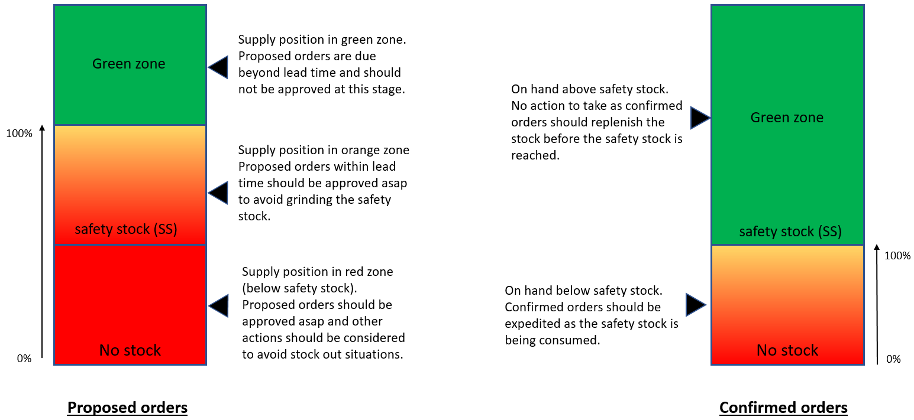

================================
Prioritization of replenishments
================================

A planning run generates a series of purchase orders, distribution
orders and manufacturing orders. 

At this stage, these orders are in proposed mode and should be approved by the planner.

It is clear to everyone that some proposed orders should be treated in urgency while others can wait. 
In order to make the planner's life easier, frePPLe has adopted a coloring convention on the purchase, 
distribution and manufacturing orders screens to allow him/her to immediatly identify the orders for which actions should be taken.

The coloring convention depends on the zone where the supply position stands.

Red : An immediate action should be taken.

Orange : An urgent action should be taken.

Green : No action should be taken.

The coloring convention applies to both proposed and confirmed orders but the actions to be taken differ.

In the green zone, the stock doesn't need to be replenished (as actions have already been taken) and any proposed order from frePPLe would then have a due date beyond the lead time of the part.
Whenever the supply position is in the green zone, any proposed order will be displayed in green.

Whenever the on hand is above safety stock, any confirmed order will be displayed in green.

The orange zone is the first zone where planner attention is required :
When the supply position of an item evolves in the orange zone, it means that frePPLe should have already generated a proposed order to replenish that item.
That proposed order will be displayed in orange in frePPLe as an approval action is required from the planner. 

Whenever the planner approves that order, 
it should immediately be replaced by a green approved order (as no more action is required from the planner). 

If the on hand position of a buffer falls below safety stock, all confirmed requests replenishing that buffer will turn orange,
letting the planner know that he/she might expedite these confirmed orders.

The red orders should immediately draw planner's attention as stock out risk is high.
 
- A *confirmed* purchase order, distribution order or manufacturing order
  is colored first orange and gradually to red when the on hand in the inventory buffer it feeds is 
  below its safety stock.
  
  The planner should be aware of the shortage risks, and if possible take 
  actions to mitigate the shortage risk:
  
    - Expedite a purchase order with the supplier.
    
    - Prioritize a distribution order for shipment on the next truck or
      container.    
    
    - Prioritize a manufacturing order on its routing through all
      operation steps and resources.
  
       
- A *proposed* new purchase order, distribution order or manufacturing order
  is colored red when it's time to confirm a new order.
  
  The expected action from the planner is:
  
    - Place a new purchase order to the supplier.
    
    - Create a new distribution transfer order in the ERP system.
    
    - Start the proposed manufacturing order in the factory. 
  
       
- Proposed purchase orders, distribution orders or manufacturing orders *beyond*
  *the lead time horizon* are colored gray in frePPLe.
  
  We don't expect the planner to take any action on these. These transactions
  provide visibility of what's ahead.  
  
  

This prioritisation scheme is heavily inspired on the DDMRP methodology 
("demand driven material requirements planning" - see http://demanddrivenmrp.com/ 
- To be clear: frePPLe doesn't claim compliance to the DDMRP and in multiple
points deviates from its philosophy)
