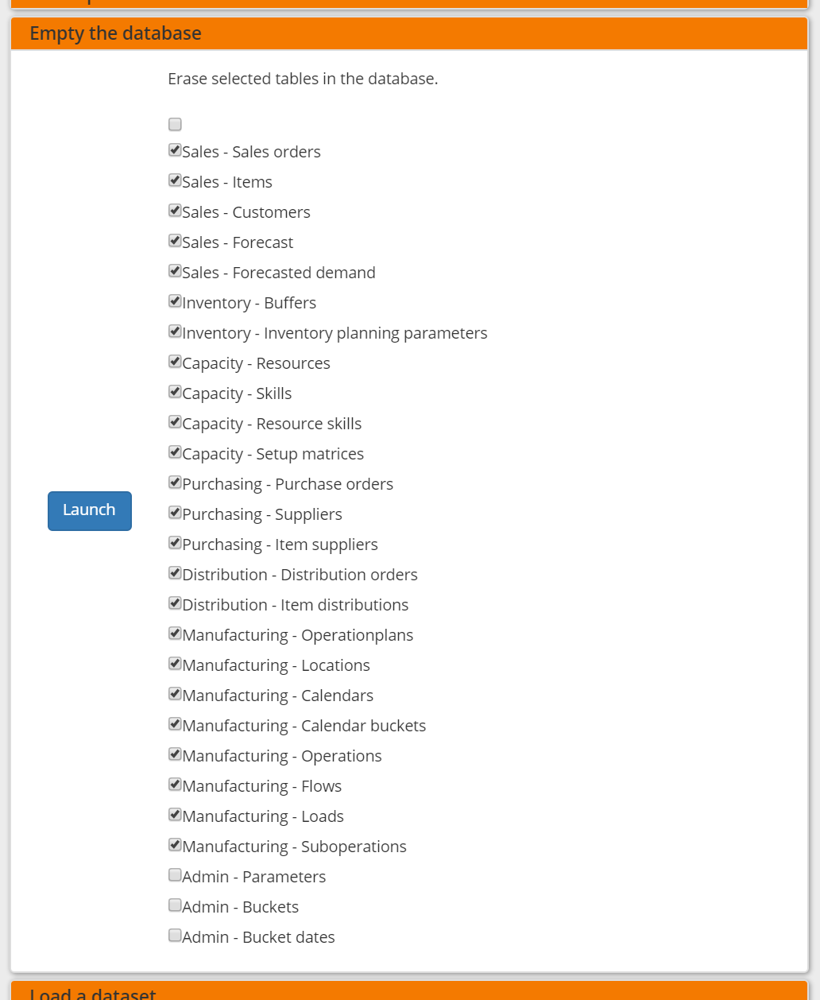
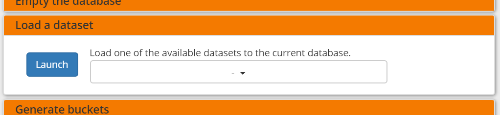
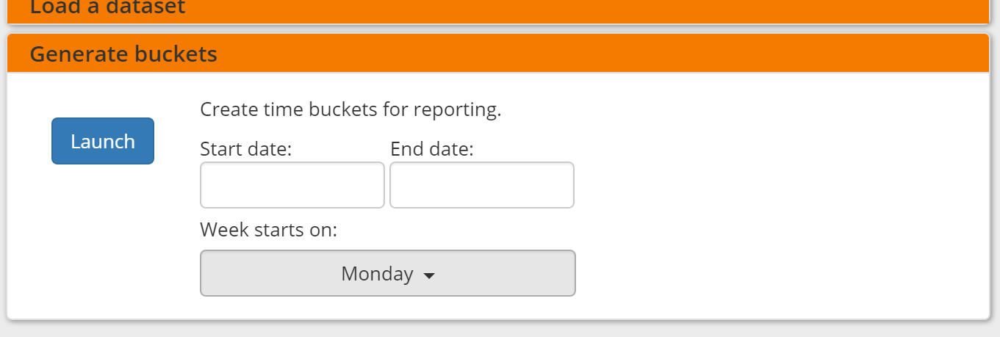

================
Execution screen
================

This screen allows you to perform a number of administrative actions.

.. image:: _images/execution.png
   :alt: Execution screen

The status section at the top of the screen is refreshed every 5 seconds.
You can disable the refreshing by clicking on the autorefresh icon.

| Tasks launched in this screen are all executed asynchronously: when you hit
  the launch button the task is added to a job queue. A separate worker process
  will execute the tasks from the queue.
| Note that all the actions (and more) can also be performed synchronously
  from the command line with the frepplectl script.

The actions that can be performed from this screen are listed below. The list
can be extended with custom commands from an extension module.

Generate a plan
---------------

This option runs the frePPLe planning engine with the input data from the
database. The planning results are exported back into the database.

Two main plan types can be distinguished, based on whether you want to
see demand OR material, lead time and capacity problems to be shown.

* A **constrained plan** respects all enabled constraints. In case of shortages
  the demand is planned late or short. No any material or capacity shortages
  are present in the plan.

* An **unconstrained plan** shows material, capacity and operation problems
  that prevent the demand from being planned in time. The demand is always met
  completely and on time.

In both the constrained and unconstrained plans you can select which constraints
are considered during plan creation.

.. image:: _images/execution-plan.png
   :alt: Execution screen - Plan generation

Export a spreadsheet
--------------------

This task allows you to download the complete model as a single spreadsheet
file. The spreadsheet can be opened with Excel or Open Office.

A seperate sheet in the workbook is used for each selected entity.

The exported file can be imported back with the task described just below.

.. image:: _images/execution-export.png
   :alt: Execution screen - Spreadsheet export

Import a spreadsheet
--------------------

This task allows you to import an Excel spreadsheet.

A seperate sheet in the workbook is used for each selected entity.

The sheet must have the right names - in English or your language. The first row
in each sheet must contain the column names.

.. image:: _images/execution-import.png
   :alt: Execution screen - Spreadsheet import

Import/Export data files from folder
------------------------------------

This task allows importing or exporting data from a set of CSV-formatted files.
The purpose of this task is to help the exchange of information with other systems.

The files are all placed in a folder that is configurable with the UPLOADFILEFOLDER
in the djangosettings.py configuration file. The log files importfromfolder.log 
and exporttofolder.log record all data imports and file exports, in addition to 
any data errors identified during their processing.

The data files to be imported must meet the following criteria:

* The name must match the data object they store: eg demand.csv, item.csv, ...

* The first line of the file should contain the field names

* The file should be in CSV format. The delimiter depends on the default
  language (configured with LANGUAGE_CODE in djangosettings.py).
  For english-speaking countries it's a comma. For European countries
  it's a semicolon.

* The file should be encoded in UTF-8 (configurable with the CSV_CHARSET
  setting in djangosettings.py)

In this option you can see a list of files present in the specified folder.

.. image:: _images/execution-importexportfolder.png
   :alt: Execution screen - Import/Export data from/to folder

Web service
-----------

In the Enterprise Edition users have the option to start and stop the web service
which keeps the plan in memory.

.. image:: _images/execution-webservice.png
   :alt: Execution screen - Web service

Scenario management
-------------------

This option allows a user to copy a dataset into a what-if scenario.

When the data is successfully copied, the status changes from 'Free'
to 'In use'.

When the user doesn’t need the what-if scenario any more, it can be released
again.

.. image:: _images/execution-scenarios.png
   :alt: Execution screen - what-if scenarios

Back up database
----------------

This task dumps the contents of the current database schema to a flat file.

The file is created in the log folder configured in the configuration files
djangosettings.py.

.. image:: _images/execution-backup.png
   :alt: Execution screen - backup

Erase the database
------------------

This will delete all data from the current scenario (except for some internal
tables for users, permissions, task log, etc...).

Load a predefined dataset in the database
-----------------------------------------

A number of demo datasets are packaged with frePPLe. Using this action you can
load one of those in the database.

The dataset is loaded incrementally in the database, **without** erasing any
previous data. In most cases you’ll want to erase the data before loading any
of these datasets.

You can use the dumpdata command to export a model to the appropriate format
and create your own predefined datasets.

Generate time buckets
---------------------

A number of output reports are displaying the plan results aggregated into time
buckets. These time buckets are defined with the tables dates and bucket dates.
This tasks allows you to populate these tables in an easy way.

