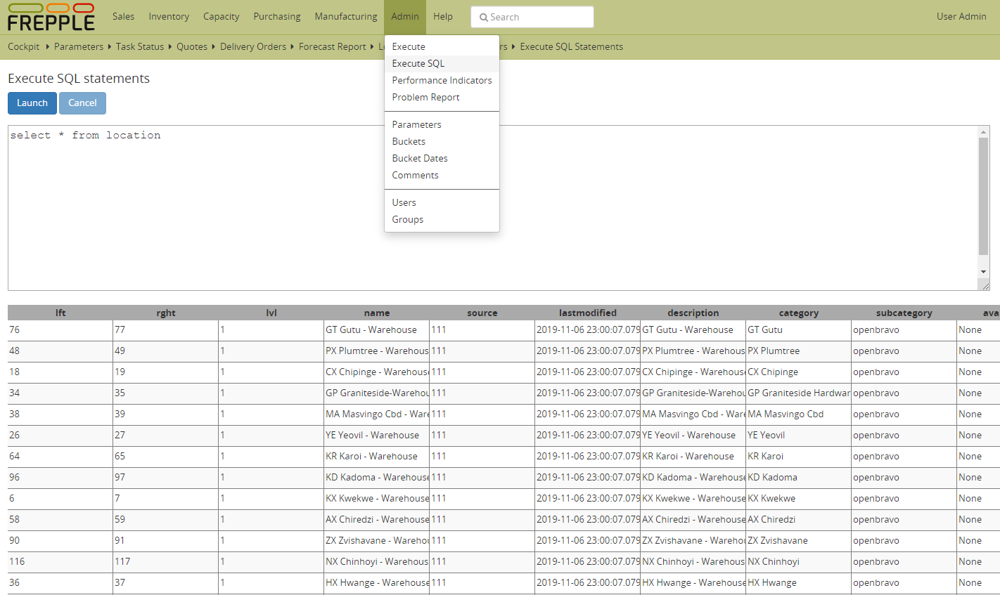

====================
SQL execution screen
====================

.. Important::

   This capability should only be used in development environments.
   
   Giving access to this feature in production environments and/or
   end users is insecure and can corrupt the database contents.
   
This screen allows you to run SQL statements on the frePPLe database.

The menu is shown when all the following conditions are met:

- The executesql app is activated in INSTALLED_APPS section of 
  the djangosettings.py file.
  
- You have superuser privileges.
