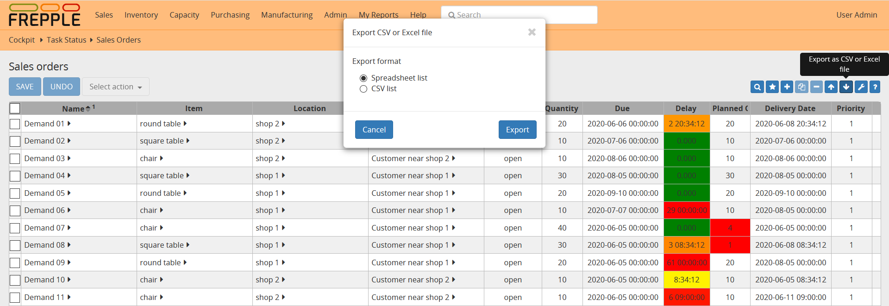

==============
Exporting data
==============

You can export the data either a) as a **native Excel workbook** or b) as
a **CSV-formatted text file** by clicking on the download arrow on the upper
right.

For report with time buckets, two structures are available:

* | **Table**:
  | Uses the same layout as shown on the screen. The time buckets are shown
    as columns in the CSV-file.

* | **List**:
  | A separate line is generated for each time bucket. This flat format can
    be more appropriate for further processing by other tools.

The export is not limited to the page currently displayed on the screen,
but all pages in the filtered selection will be exported.

A couple of notes on the CSV-format:

* The separator in the CSV-files varies with the chosen language: If in your
  language a comma is used as a decimal separator for numbers, the CSV file
  will use a semicolon (;) as delimiter. Otherwise a comma (,) is used.
  See http://en.wikipedia.org/wiki/Decimal_mark

* The date format exported and imported by frePPLe is 'YYYY-MM-DD HH:MM:SS'.
  Microsoft Excel tends to export dates in your local format, which can cause
  problems when you save the file again and try to importing it back in frePPLe.
  The best approach is to import the cells as text to avoid any conversion.

* The export process will encode the data file in the encoding defined by the
  setting CSV_CHARSET (default UTF-8).

.. Tip::
   Exporting to Excel format avoids these common pitfalls from the CSV
   text-files.

In the :doc:`../execute` you also have the capability to export all entities
into a single Excel workbook.

