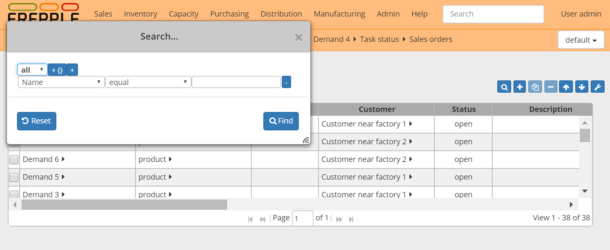

==============
Filtering data
==============

All screens display a filter icon in the tool bar on the upper left. Clicking
the icon pops up a small window where you can specify the filters. The filter
expression can use any of the attributes in the screen, and combine them with
AND or OR conditions.

When the displayed data are filtered, the applied filters are shown above
the data. The filter values can be edited, which allows quick re-filtering.

When the filter value is empty, that criterion is not considered in the filter.

In the **Enterprise Edition** filter criteria are automatically stored on the
server: see :doc:`customizing-a-report`. When you reopen the report later on,
the report will open with the same filter criteria as when you left it.

