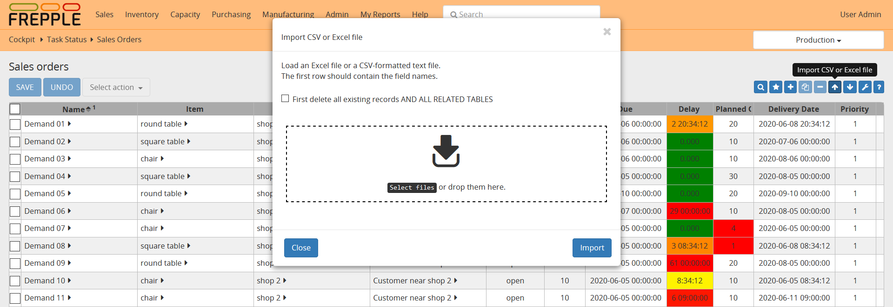

==============
Importing data
==============

You can upload data files in a) **native Excel format** or 
b) **CSV format**. Clicking on the import arrow in the upper
right corner allows you to select the file to upload. 
Note that you can also drag and drop a file into the dialog box.
FrePPLe automatically detects which of the two data formats you're using.

The upload icon will only be available when you have add-permission on
the data object you're uploading. A message is shown when you don’t have
this permission.

The first line in the data file should contain the field names (not case
sensitive). To get a sample of the input format you can first create a export:
the format of the export file is such that it can be reread into frePPLe.

The dialog screen shows a checkbox *First delete all existing records AND ALL RELATED TABLES*
meaning that you can choose to delete the existing contents of the table before uploading
the new data. When the option is selected, dependent tables are also erased:
e.g. if you select this option when uploading the *resource* table, also the *operationresource* 
table will be erased since the second table references the first one.

.. Caution::
   If you're not very familiar with the relation between the objects in frePPLe's
   data model, you probably shouldn't use the *First delete all existing records AND ALL RELATED TABLES* option.

After the upload, the number of data rows loaded will be displayed.
When data errors were found during the loading process the details will be shown
as well.

A couple of notes on the CSV-format:

* The separator in your CSV-files varies with the chosen language: If in your
  language a comma is used as a decimal separator for numbers, the CSV file
  will use a semicolon (;) as delimiter. Otherwise a comma (,) is used.
  See http://en.wikipedia.org/wiki/Decimal_mark

* The date format expected by frePPLe is 'YYYY-MM-DD HH\:MM\:SS'.

* The data file is expected to be encoded in the character encoding defined by
  the setting CSV_CHARSET (default UTF-8).

.. Tip::
   Importing a native Excel file avoids these common pitfalls from the CSV
   text-files.

In the Admin/Execute menu you also have the capability to import multiple tables
from a single Excel workbook using the *Import a spreadsheet* option.

