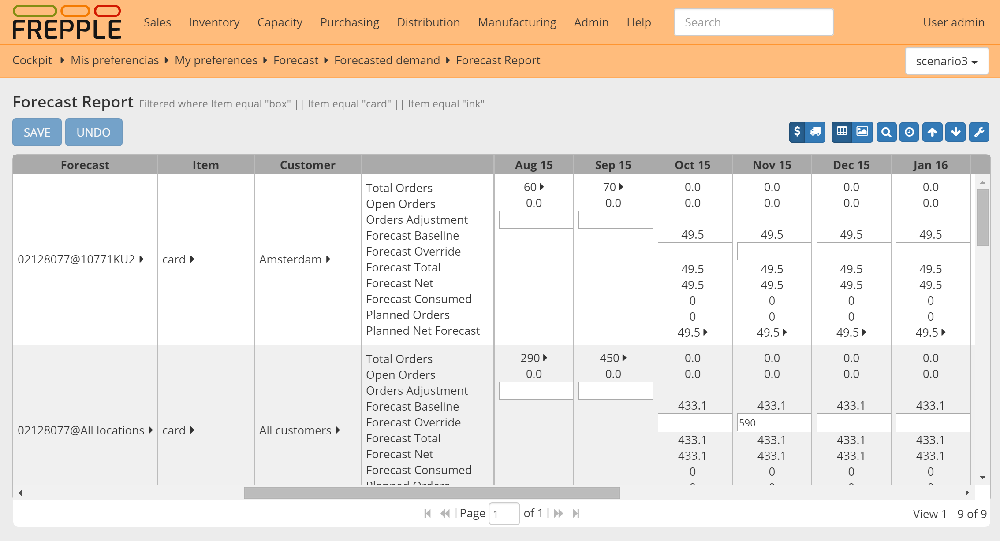

===============
Forecast report
===============

.. Important::

   This report is only available in the Enterprise Edition.

This report provides a convenient way to review and enter forecast numbers. When entering
forecast numbers, the numbers will be disaggregated to the planning buckets.

==================== ==============================================================================
Field                Description
==================== ==============================================================================
Forecast             Name of the forecast
Item                 Forecasted item.
Customer             Forecasted customer.
Location             Forecasted location.
Total Orders         Quantity of orders in the time bucket, includes both open and closed
                     orders.
Open Orders          Quantity of open orders in the time bucket.
Orders Adjustment    | Manual adjustment added to the total order quantity.
                     | This adjustment can be applicable for a) removing exceptional demand
                       outliers from the demand history, or b) intializing the forecast for a new
                       product with the demand history of a similar, existing product.
                     | The forecast calculations add the order adjustment and the total orders
                       as the demand history input for the calculation.
Forecast Baseline    Statistical forecast generated by the system.
Forecast Override    | Manual adjustment of the forecast.
                     | If a value is entered in this row, it completely replaces the baseline
                       forecast proposed by the system.
Forecast Total       Sum of the baseline forecast and the forecast adjustment.
Forecast Net         Forecast quantity not yet consumed by orders.
Forecast Consumed    Forecast quantity already consumed by orders.
Planned Orders       Quantity of orders planned in this time bucket.
Planned Net Forecast Quantity of net forecast planned in this time bucket.
==================== ==============================================================================

.. image:: ../_images/forecast-report-single.png
   :alt: Forecast report for a single item

.. image:: ../_images/forecast-report-graph.png
   :alt: Forecast report as a graph

