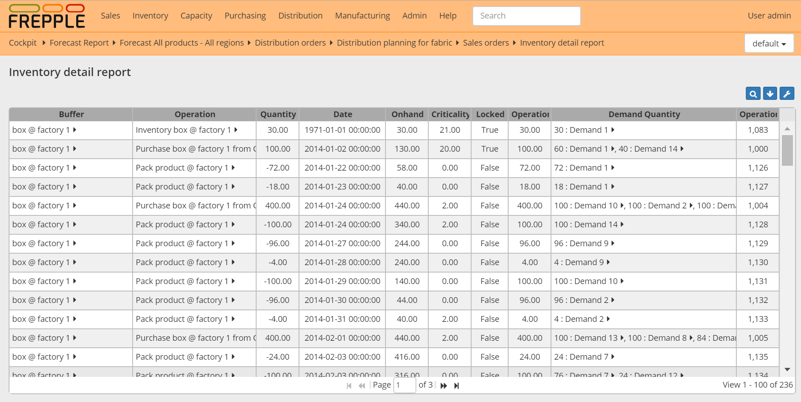

=======================
Inventory detail report
=======================

The report shows the details of all material production into and consumption from buffers.

================= ==============================================================================
Field             Description
================= ==============================================================================
Buffer            Buffer name.
Type              Type of the operation:

                  - MO: Manufacturing order
                  - PO: Purchase order
                  - DO: Distribution order
                  - DLVR: Delivery of a sales order to a customer
                  - STCK: On hand
Operation         Name of the operation producing or consuming material.
Quantity          Amount being produced (positive number) or consumed (negative number).
Date              | Date of the stock movement.
                  | Inventory that is reported as onhand at the start of the plan will be shown
                    with 1/1/1971 as date.
Onhand            Available inventory in the buffer after this particular stock movement.
Feasible          | Boolean field indicating whether the operationplan is violating any
                    material, lead time or capacity constraints.
                  | This is very handy in interpreting unconstrained plans.
Criticality       | Indication of the urgency of the operationplan.
                  | A criticality of 0 indicates that the operationplan is on the critical
                    path of one or more demands.
                  | Higher criticality values indicate a delay of the operationplan will
                    not immediately impact the delivery of any demand.
                  | A criticality of 999 indicates an operationplan that isn't used at all to
                    meet any demand.
Status            Status of the operationplan:

                  - proposed: newly proposed by the planning tool
                  - approved: approved by the planner, but not yet launched in the ERP system
                  - confirmed: ongoing transaction, controlled by the ERP system and not changeable
                    in frePPLe
                  - closed: operation has finished 
Operationplan     Identifier of the operation plan planning the stock movement.
================= ==============================================================================

