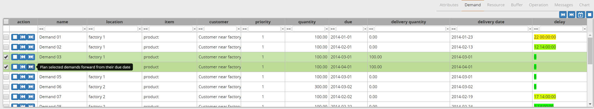

===========
Plan editor
===========

.. Important::

   This module is only available in the Enterprise Edition.

The plan editor report provides an interactive Gantt chart
where the user can interactively review and edit the plan.

.. image:: ../_images/plan-editor.png
   :alt: Interactive Gantt chart report

Every user can personalize the report by selecting entities from
the bottom lists and adding them to the chart.  

The report all interactive replanning of demands. 

 - | The square icon **unplans** a single demand (or a list of selected demands).
   | All operationplans associateded with this demand(s) are removed from the 
     plan. Only operationplans in the 'proposed' status can be removed.
 
 - | The back arrow icon **plans a demand(s) in backward planning mode**.
   | This means that we search to plan the demand for a delivery as close as
     possible to its due date.
     
 - | The forward arrow icon **plans a demand(s) in forward planning mode.**
   | This means that we plan for an ASAP delivery of the order, starting 
     all purchasing and production immediately.

The plan can visualized in different ways:

 - | **Color by feasibility**
   | This is the default color. It highlights operationplans that are
     not feasible due to capacity overloads, material shortages or 
     lead time constraints.
     
 - | **Color by criticality**
   | An operationplan is considered critical if it is on the critical
     path of one or more demands. Any delay on a critical operationplan
     will result in a late delivery to a customer. It will show up as red.
   | When additional "slack time" is available in the plan the operationplan
     is less sensitive to plan disturbances. It is less critical and will 
     shown in yellow to green.
     
 - | **Color by delay**
   | An operationplan is considered delayed if it ends later than required 
     to meet the demand on time. This delay also considers the processing
     time at the following manufacturing steps.
   | Delay and criticality are related metrics, but still distinct. For
     instance, if all operationplans for a demand are planned in a just-in-time
     sequence without gaps they will be considered critical, ie red by the 
     criticality criterion. The operationplans still deliver the demand on 
     time so they will show up as on time, ie gree by the delay citerion. 
        
 - | **Color by item category**
   | The color of an operationplan is determined by the category of the item
     it produces. The category is supplied by the user in the item.category
     field. 
   | The plan editor allows to choose a color for up to 9 categories,
     plus a default color for other categories.

 - | **Color by item subcategory**
   | See above, but now based on the item.subcategory field.
   
 - | **Color by operation category**
   | See above, but now based on the operation.category field.
   
 - | **Color by operation subcategory**
   | See above, but now based on the operation.subcategory field.

.. image:: ../_images/plan-editor-color1.png
   :alt: Configuring Gantt chart colors

.. image:: ../_images/plan-editor-color2.png
   :alt: Configuring Gantt chart colors
   
The color configuration is automatically saved when a user with superuser 
privileges changes them. To assure that all users apply the same color 
conventions, the settings are shared.
     