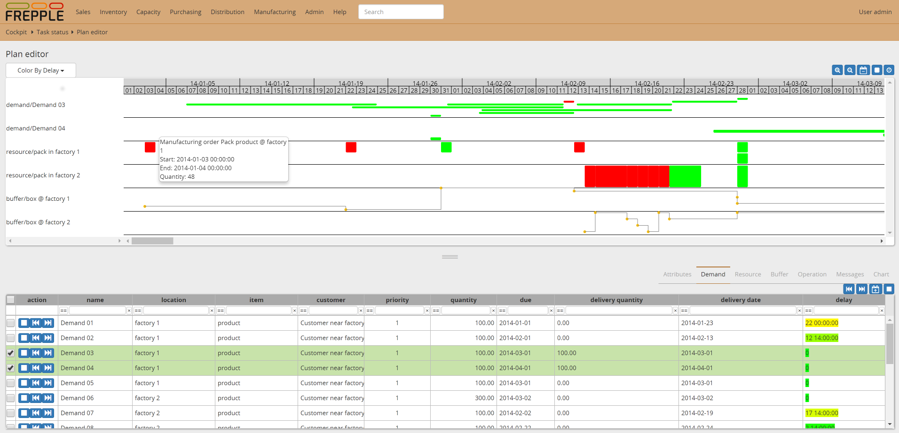
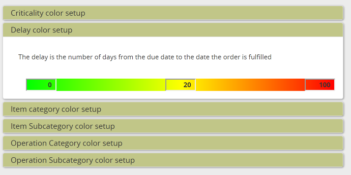

===========
Plan editor
===========

.. Important::

   This report is only available in the Enterprise Edition.

The plan editor report provides an interactive Gantt chart
where the user can visually review the plan and make changes to it.

* `Customizing the layout`_
* `Interactive changes to the plan`_
* `Visualization color schemes`_

Customizing the layout
----------------------

The gantt chart visualizes the plan for resource, sales orders
or inventory of an item.

Every user can personalize the report to show those entities he/she is
interested in. Use the lists at the bottom of the screen to search for
entities, and click on the plus icon to add them to the chart.  

Also the time scale of the report can be adjusted. Use the clock icon
in the upper right to adjust the horizon. You can zoom in with the looking
glass icons. 

Interactive changes to the plan
-------------------------------

The report supports a number of ways to interactively change the plan:

 - You can **move a manufacturing order to a new date**. You can drag and drop
   them in the graph, or manually type in the new date of a selected 
   manufacturing order. 
   
 - You can **edit quantity, dates and status of a selected manufacturing order**
   in the bottom section of the screen.
  
 - You can **assign the manufacturing order to an alternate resource**
   **or an alternate resource**. Drag and drop a selected operation to a different
   row in the graph (possible alternate rows can easily be identified by the icon 
   at the front of the row), or use the dropdown lists in the bottom of the screen.

 - You can interactively replan sales orders.

   - | The square icon **unplans one or more sales order**.
     | All plans associateded with the selected sales orders are removed from the 
       plan. Only operationplans in the 'proposed' status can be removed.
 
   - | The back arrow icon **plans one or more sales orders in backward planning mode**.
     | This means that we search to plan the demand for a delivery as close as
       possible to its due date.
     
   - | The forward arrow icon **plans one or more sales orders in forward planning mode.**
     | This means that we plan for an ASAP delivery of the order, starting all purchasing
       and production immediately.

   .. image:: ../_images/plan-editor-replan.png
      :alt: Replanning demands

Visualization color schemes
---------------------------

The plan can visualized in different ways. Use the dropdown in the upper
left corner to change the color method. 

 - | **Color by feasibility**
   | This is the default color. It highlights operationplans that are
     not feasible due to capacity overloads, material shortages or 
     lead time constraints.
     
 - | **Color by criticality**
   | An operationplan is considered critical if it is on the critical
     path of one or more demands. Any delay on a critical operationplan
     will result in a late delivery to a customer. It will show up as red.
   | When additional "slack time" is available in the plan the operationplan
     is less sensitive to plan disturbances. It is less critical and will 
     shown in yellow to green.
     
 - | **Color by delay**
   | An operationplan is considered delayed if it ends later than required 
     to meet the demand on time. This delay also considers the processing
     time at the following manufacturing steps.
   | Delay and criticality are related metrics, but still distinct. For
     instance, if all operationplans for a demand are planned in a just-in-time
     sequence without gaps they will be considered critical, ie red by the 
     criticality criterion. The operationplans still deliver the demand on 
     time so they will show up as on time, ie gree by the delay citerion. 
        
 - | **Color by priority**
   | This feature visualizes the plan by the priority of the sales orders they
     are allocated to. We can easily see which manufacturing orders are associated
     with high priority demand.   
   
 - | **Color by inventory status**
   | The color is an indication of the urgency to replenish the inventory.
   | When the inventory of an item is dropping below the safety stock its color
     will gradually change from yellow (ie just below the safety stock) to red 
     (ie a complete stockout).
   | When then inventory of an item is above the safety stock the color is green.
   
 - | **Color by item category**
   | The color of an operationplan is determined by the category of the item
     it produces. The category is supplied by the user in the item.category
     field. 
   | The plan editor allows to choose a color for different categories,
     plus a default color.

 - | **Color by item subcategory**
   | See above, but now based on the item.subcategory field.
   
 - | **Color by operation category**
   | See above, but now based on the operation.category field.
   
 - | **Color by operation subcategory**
   | See above, but now based on the operation.subcategory field.

.. image:: ../_images/plan-editor-color2.png
   :alt: Configuring Gantt chart colors
   
The color configuration is automatically saved when a user with superuser 
privileges changes them. To assure that all users apply the same color 
conventions, the settings are shared.
     