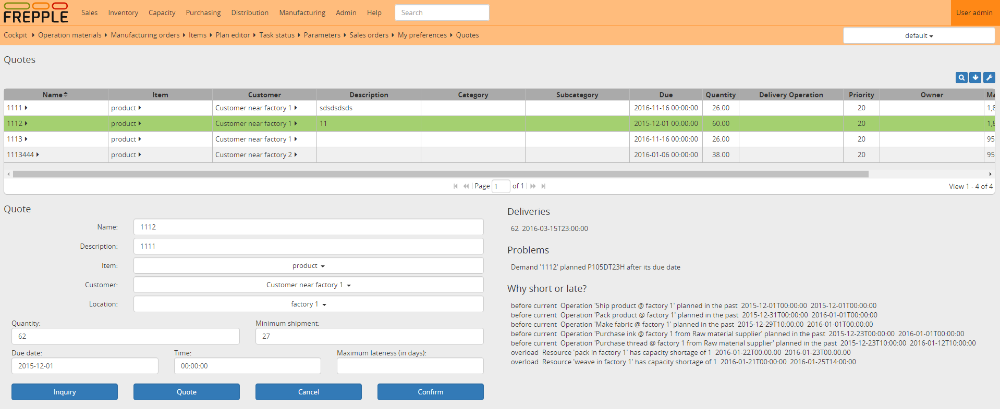

====================
Order quoting screen
====================

.. Important::

   This module is only available in the Enterprise Edition.

The order quoting screen lets you fill in a form with all information for
a new order. It allows you to quickly calculate the feasible delivery date
of the order which you can promise to your customer. 

This functionality is often called **capable to promise**.

As the quoting screen interacts with the plan in memory and we incrementally
plan the new order, you get a reply very fast - within a few seconds.
A planner or sales person can easily simulate different alternatives while
the customer is waiting on the phone.

Compared to ERP systems that compute a delivery date with a fixed procurement
and manufacturing lead time, the quoting service dynamically computes a
delivery date considering the current  material available, current free capacity
and all other constraints. 

Note that it is also possible to interact with the quoting service from
external systems. In this way you can provide the same functionality
from other systems to business users, without using this frePPLe screen.

The top section of the screen shows the list of currently open quotes.

The bottom left section allows you to fill in the order details and send a
request to the quoting service. The buttons perform the following actions:

 - | **Inquiry**: Send the new order to the quoting service and display
     the feasible delivery date.
   | An inquiry doesn’t keep any material or capacity reserved. It is thus
     possible that other orders use up that supply, and the returned
     delivery date is no longer feasible when the order is finally confirmed.

 - | **Quote**: Send the new order to the quoting service and display the
     feasible delivery date.
   | A quote keeps the material and capacity required to achieve the replied
     delivery date are reserved while the quote is open.
     This means that no other quote or inquiry can use the same supply. This
     guarantees that the delivery date is still feasible when the order is
     confirmed later on. Only when the quote is canceled does the supply get
     released.

 - | **Cancel**: Delete the quote or inquiry. 
   | In case of a quote, the reserved material and capacity are released again.

 - | **Confirm**: Moves the status of the selected quote or inquiry to an 
     open sales order. This removes the line from the top section.
   | Note that the order still needs to be entered or updated in the ERP
     system as well.

The bottom right section of the screen displays the answer of the quoting 
service. You can see the list of planned deliveries, any problems associated
with the order, and the constraints that resulted in a late or short promise.   
