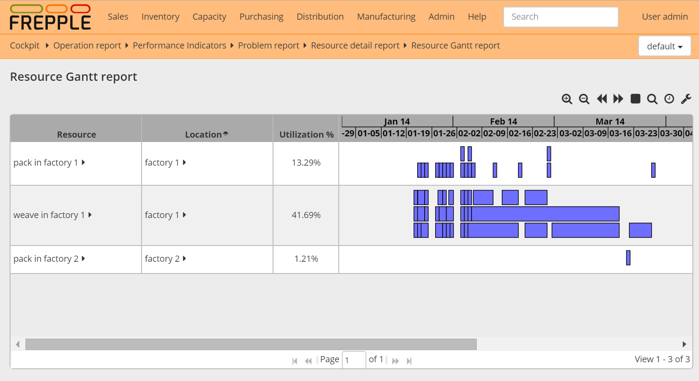

=====================
Resource Gantt report
=====================

.. Important::

   This module is only available in the Enterprise Edition.

This screen displays a Gantt chart of all operationplans planned on the
selected resources.

============== ==============================================================================
Field          Description
============== ==============================================================================
Resource       Resource name.
Location       Location of the resource.
Operationplans | Gantt chart of all operationplans planned on the resource.
               | A tooltip will display more detailed information on the operationplans when
                 the mouse is moving over it.
               | By default the screen displays the reporting horizon as the other reports.
                 The zoom and move buttons at the top can be used to display a shorter time
                 horizon.
============== ==============================================================================

