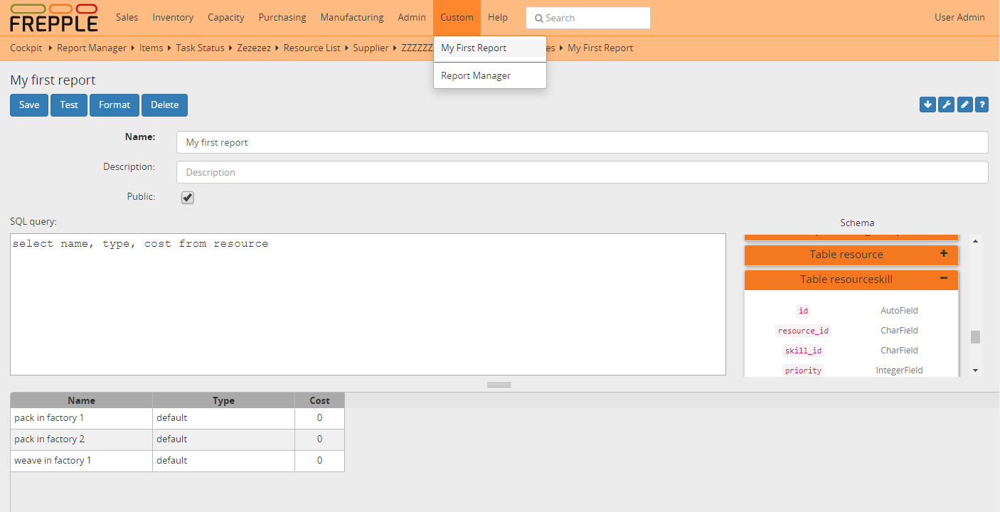

==============
Report manager
==============

The report manager allows administrators and power users to create custom reports. The reports
are written in SQL language.

Buttons in the top row allow to format the SQL code and test the query. 

When saved, custom reports show up in the menu.

By default a report is only available to the user that created it. Optionally, reports can be 
marked public and thus be shared with other users.

Custom reports can be edited by clicking on the pencil icon. Only the user that created
the report is allowed to perform this action.

.. Important::

   The custom reports run in a database role that is configurable with the setting
   DATABASES / SQL_ROLE. If not configured correctly, users can run queries that damage
   the integrity or performance of the database.
   
   For security reasons this should be set to a role that has sufficiently
   restricted permissions, eg read-only access to a subset of the database tables.
   
   If you're not familiar with this level of administration of the PostgreSQL database,
   it can be safer to disable the "report manager" app altogether in the INSTALLED_APPS
   setting.  
   
Creation of custom reports is only available to users that are granted the permission 
"reportmanager | can create custom reports".
