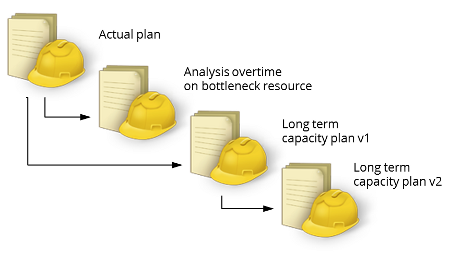
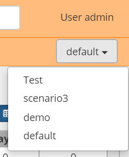
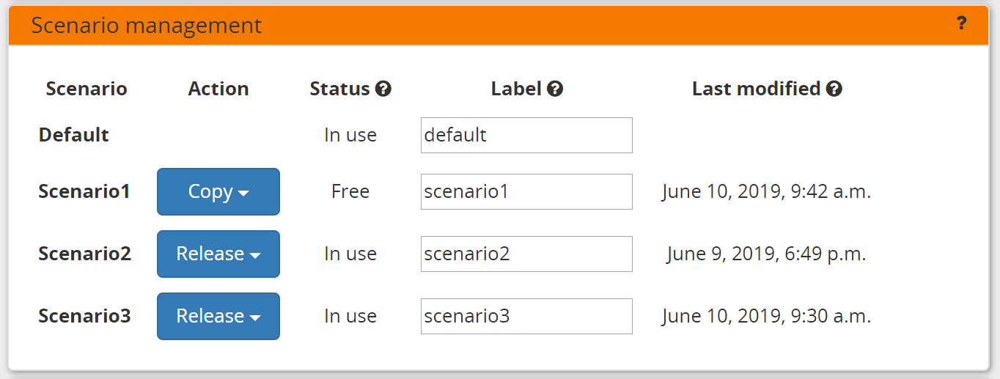

=================
What-if scenarios
=================

FrePPLe allows users to easily create alternative plans. A scenario
is complete sandbox copy of all data, such that any modification done
in it doesn't impact the production plan.

 
* `Selecting a scenario`_
* `Scenario management`_
* `Access rights and permissions`_

Selecting a scenario
--------------------

When scenarios are in use, a drop down list appears in the upper right
corner. It allows you to select the scenario to work in. 

Only scenarios to which you have access rights will be shown in the list.

Scenario management
-------------------

During the installation a number of what-if slots (3 by default) are configured 
by the administrator. See :doc:`this page </installation-guide/multi-model>` for the
details.

The scenario's can have the following states:

* **Free**:
  The slot is currently unallocated and available for use.

* **In Use**:
  Data has been copied into the scenario slot. Users can freely work
  independently in the scenario, without affecting the main model.

In :doc:`the execution screen <execute>`, you can change the status of a 
scenario slot:

* | **Copy** is used to duplicate an existing schema into a free slot.
  | After copying the scenario slot moves from *free* to *in use*.

* | **Release** is used to flag that work on the what-if scenario
    slot has finished.
  | After releasing the scenario slot moves from *in use* to *free* again.

The label shown in the scenario selection dropdown can also be updated
in this screen.

Access rights and permissions
-----------------------------

Access rights and permissions can be managed for each scenario individually.

When copying of a new scenario, it will initially be accessible by 1) the user
creating the copy and 2) all superusers in the source scenario.

A user must be marked active in a scenario before it will appear in the list of 
available scenarios.

The superuser status of a user can be different in each scenario. Users can have
completely different role and permissions in each scenario. 

The list of users and their passwords is always identical in all scenarios. 

.. image:: _images/user-list.png

See :doc:`/user-guide/user-interface/getting-around/user-permissions-and-roles`
for more details on the configuration of access rights.
