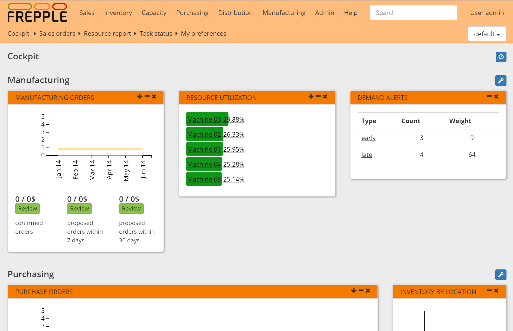

===========
Home screen
===========

The home page of is a dashboard with widgets that a planner uses in his daily planning
activities. It is an efficient starting point for the common activities.

The home screen is configurable by every user to meet his/her requirements and taste.

The following widgets are available:

* | **Inbox**
  | An overview of notifications and messages.

* | **Welcome widget**
  | A welcome text to give first-time users some guidance to get started
    with the application.

* | **News**
  | This widget picks up the latest news topics from frepple.com.

* | **Recent actions**
  | Shows your most recent editing actions.

* | **Purchase orders**
  | Provides a high level overview of the open purchase orders, and new
    orders that will need to be created soon.

* | **Purchase queue**
  | Displays a list of new purchase orders that should be placed on your
    suppliers.

* | **Distribution orders**
  | Provides a high level overview of the open distribution orders, and new
    orders that will need to be created soon.

* | **Distribution queue**
  | Displays a list of new distribution orders that should be placed.

* | **Manufacturing orders**
  | Provides a high level overview of the open manufacturing orders, and new
    orders that will need to be created soon.

* | **Resource queue**
  | This is the list of operations that are about to be started on each
    resource.

* | **Shipping queue**
  | Displays a list of customer orders that are about to be shipped.

* | **Generate plan**
  | Regenerates a constrained plan.

* | **Alerts**
  | Shows a summary of the exceptions and problem areas.

* | **Analyze late demands**
  | Shows a short list of items with the most late demands.

* | **Purchase order analysis**
  | Shows the urgency of the existing (locked) purchase orders.

* | **Resource utilization**
  | Displays the resources with the highest utilization.

* | **Delivery performance**
  | This widget shows the percentage of order lines that are planned to be
    shipped on time.

* | **Demand history**
  | Displays the historical evolution of the open sales orders.

* | **Inventory history**
  | Displays the historical evolution of the inventory.

* | **Inventory evolution**
  | This widgets shows the archived inventory value from the past, followed
    with the projected evolution of the inventory value in the future.

* | **Inventory by location**
  | This widget shows the locations carrying the most inventory.

* | **Inventory by item**
  | This widget shows the items which take up the most inventory value.

* | **Inventory analysis**
  | Display an analysis of which item-locations have stockout risks.
  | Depending on the stockout risk, a red/yellow/green color code is assigned.
  | The widget shows the number of item-locations in each color code by location.

* | **Forecast error**
  | Display the Symmetric Mean Percentage Error (aka SMAPE). The result is
    aggregated across all forecast per bucket, weighted by the forecast quantity.
  | The widget is only available in the Enterprise Edition and when the
    forecasting module is enabled.
