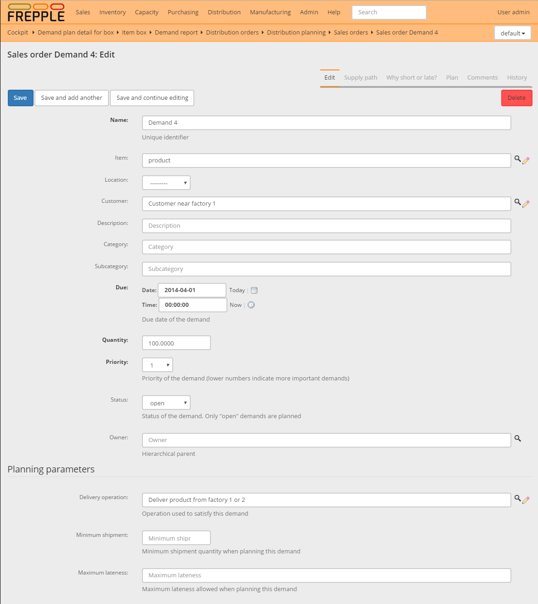

================
Data maintenance
================

FrePPLe has fully integrated data maintenance capabilities, including an audit
trail of all changes.

When you don't have edit or add permissions this options will automatically
be hidden from the screens.

Data can be edited in different ways:

* | **Edit data in the grid**
  | Updated cells are marked in bold and the save icon will turn red. Hit the
    save icon to store the changes on the server. Or hit cancel to restore
    the original values.
  | You can use the plus and minus icon to add and remove rows.
  | You can also select one or more rows and duplicate them.

* | **Edit the data in a form**
  | Each entity has an edit form.

* | **Import an Excel file or CSV-text file**
  | For mass changes to the data, it'll be easier to export the data to Excel,
    apply the changes in Excel and upload the new file.
  | See :doc:`getting-around/importing-data`.

.. image:: _images/edit-table.png
   :alt: Edit using a table

