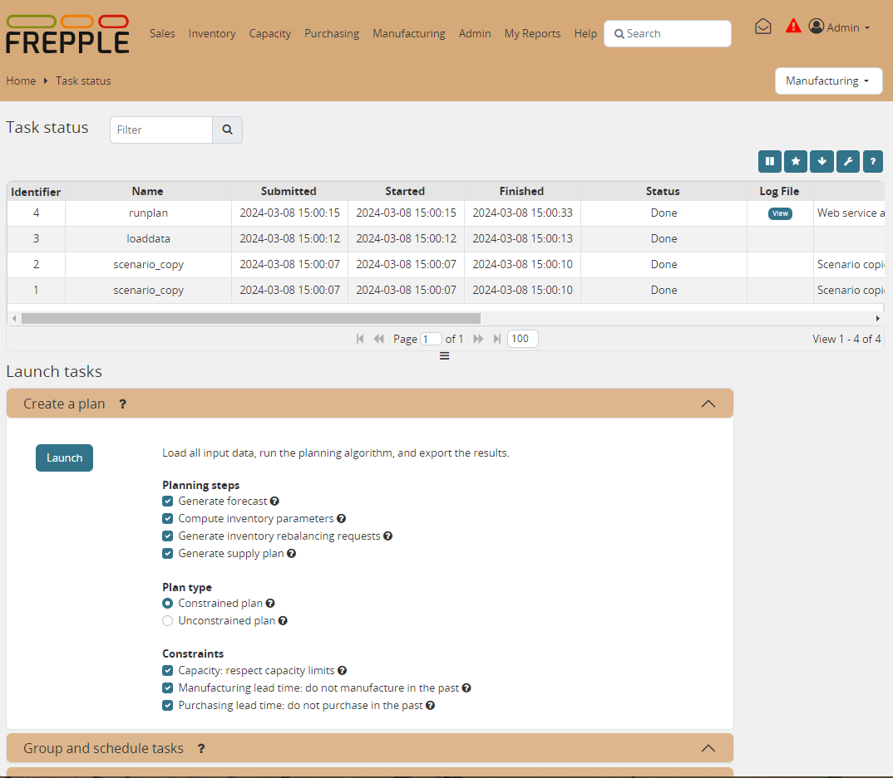

================
Execution screen
================

This screen allows you to perform a number of administrative actions.

* :ref:`runplan`
* :ref:`exportworkbook`
* :ref:`importworkbook`
* :ref:`exporttofolder`
* :ref:`importfromfolder`
* :ref:`runwebservice`
* :ref:`scenario_copy`
* :ref:`backup`
* :ref:`empty`
* :ref:`loaddata`
* :ref:`createbuckets`

The status section at the top of the screen is refreshed every 5 seconds.
You can disable the refreshing by clicking on the autorefresh icon.

| Tasks launched in this screen are all executed asynchronously: when you hit
  the launch button the task is added to a job queue. A separate worker process
  will execute the tasks from the queue.

| All the actions (and more) can also be performed synchronously
  from the command line with the frepplectl script: see
  :doc:`/integration-guide/batch-commands`
  
| It is also possible to launch tasks through a web interface: see 
  :doc:`/integration-guide/remote-commands`
