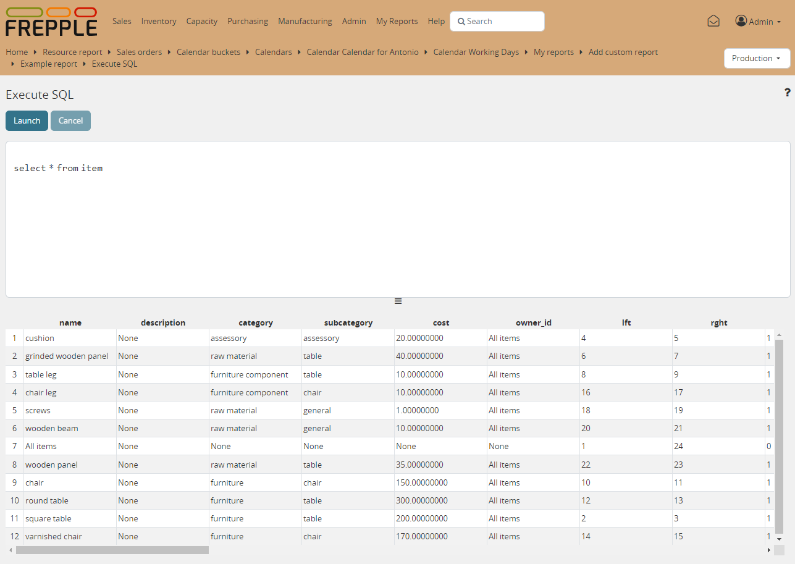

====================
SQL execution screen
====================

  .. Important::

     The SQL queries are run in a database role that is configurable with the setting
     DATABASES / SQL_ROLE. By default this role has only read permissions
     to a subset of the database tables.

     Database administrators can grant additional permissions, if required.

This screen allows you to run SQL statements on the frePPLe database.

The menu is shown when all the following conditions are met:

- The executesql app is activated in INSTALLED_APPS section of
  the djangosettings.py file.

- You have superuser privileges.

If the read-only rights are no sufficient to you, you can either:

- Ask the database administrotor to run postgres grant commands to the
  tables and database objects you are interested in. This is the recommend
  way to keep production instance safe and secure.

- You can update the DATABASES section in the file /etc/frepple/djangosettings.py
  and set the SQL_ROLE to None. The SQL commands then run with full access
  permissions. Easy and convenient for a development environment, but not secure and
  not suitable for production environments.
