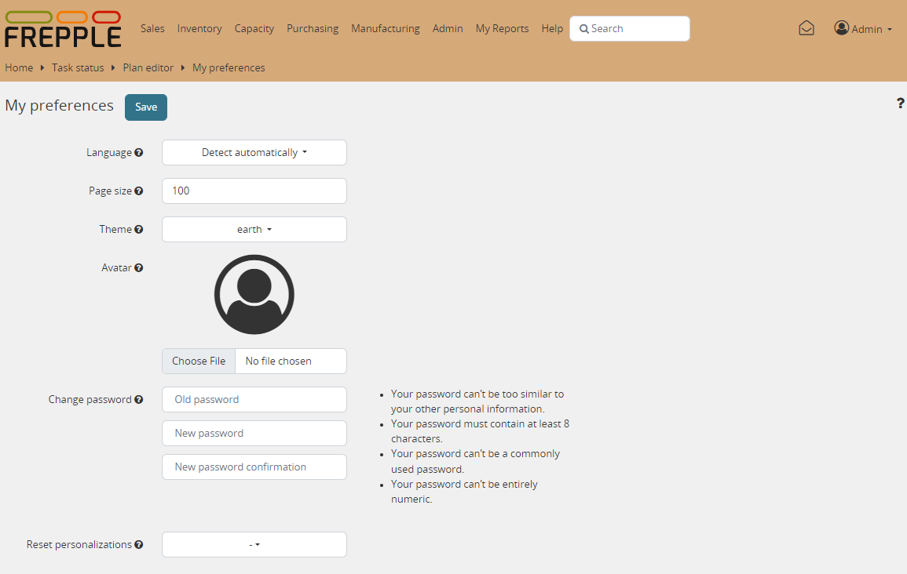

======================
Changing your password
======================

You can change your password from the login screen, or from the preferences
screen that show when you click your user name in the top right corner of
the screen.

An administrator can use the user administration screen to change passwords as well.

Users often choose poor passwords. We enforce the following validation rules for passwords:

* Passwords need to be at least 8 characters.

* Passwords cannot be similar to the user name, email address, first name or last name.

* Passwords cannot be entirely numeric.

* Password cannot be part of a list of commonly used passwords.

