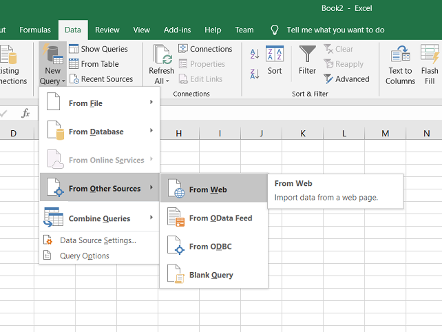

==============
Exporting data
==============

You can export the data either a) as a **native Excel workbook** or b) as
a **CSV-formatted text file** or c) **as a data source URL** by clicking
on the download arrow on the upper right.

For report with time buckets, two structures are available:

* | **Table**:
  | Uses the same layout as shown on the screen. The time buckets are shown
    as columns in the CSV-file.

* | **List**:
  | A separate line is generated for each time bucket. This flat format can
    be more appropriate for further processing by other tools.

The export is not limited to the page currently displayed on the screen,
but all pages in the filtered selection will be exported.

A couple of notes on the CSV-format:

* The separator in the CSV-files varies with the chosen language: If in your
  language a comma is used as a decimal separator for numbers, the CSV file
  will use a semicolon (;) as delimiter. Otherwise a comma (,) is used.
  See http://en.wikipedia.org/wiki/Decimal_mark

* The date format exported and imported by frePPLe is 'YYYY-MM-DD HH:MM:SS'.
  Microsoft Excel tends to export dates in your local format, which can cause
  problems when you save the file again and try to importing it back in frePPLe.
  The best approach is to import the cells as text to avoid any conversion.

* The export process will encode the data file in the encoding defined by the
  setting CSV_CHARSET (default UTF-8).

.. Tip::
   Exporting to Excel format avoids these common pitfalls from the CSV
   text-files.

In the :doc:`../execute` you also have the capability to export all entities
into a single Excel workbook.

.. image:: ../_images/exporting-data.png
   :alt: Exporting data

If the user has permissions on other scenarios for the view he/she is trying to export,
another window dialog will be displayed with these scenarios.

By default only current scenario will be selected and the user cannot disable this selection.

If the user selects extra scenarios then the generated spreadsheet or CSV file will contain
data for all selected scenarios. An extra column "scenario" is added in the file to clearly
identify to which scenario a data row belongs to.

===============
Data source URL
===============

With this option we provide a URL where external applications have on line access to the report data.

The data source URL can be pasted in any kind of reporting software supporting this format (Excel, Google sheets...).
This is pretty convenient if you are exporting the page you are visiting on a regular basis as refreshing your data in your software
will take no longer than a click.

The video below demonstrates how to pull frePPLe data in an Excel spreadsheet.

.. raw:: html

   <iframe width="640" height="360" src="https://www.youtube.com/embed/7t88FliH1h0" frameborder="0" allowfullscreen=""></iframe>

Below are the steps to configure a data source URL in Excel:

* Select the scenarios you wish to export (by default, only current scenario is selected).

* Click on the "Copy to clipboard" button so that frePPLe copies the data source URL into your clipboard. Note that this functionality
  is also available for the reports created with the `report manager <../../user-interface/report-manager.html>`_.

* Open a new spreadsheet in Excel, move to the "Data" menu and select "New Query", then "From Other Sources" and finally "From Web".
  Note that, in some old versions of Excel, this requires the installation of the Power Query module.

* Paste the URL in the clipboard in the field and press ok.

.. image:: ../_images/excel-data-source-url-2.png
   :alt: Exporting data

* Your credentials need to be populated in Excel so that it can connect to your frePPLe instance.
  Choose the "basic" option and enter your frePPLe username and password. Note that, as long as the connection uses the https protocol
  (which is always the case for the frePPLe cloud users), the crendentials are encrypted.

.. image:: ../_images/excel-data-source-url-3.png
   :alt: Exporting data

* If Excel has been able to connect to your frePPLe instance, Excel should display data from your report in a dedicated window:

.. image:: ../_images/excel-data-source-url-4.png
   :alt: Exporting data

* At this point, you have the choice to either load your data or most likely transform your data to select which columns to display,
  in which order and possibly add calculated columns. Note that all the columns of the view are available before transformation and all crosses
  also in case of a pivot report (reports where time bucket is a column such as inventory or capacity reports) so exporting
  your data using the data source URL will differ from the columns selection you have on frePPLe. Once transformed, you can then load your data.

* The magic happens when the report you have exported using the data source URL is modified in frePPLe, you have the possibility in Excel to
  refresh your data in a simple click using the "refresh" option. This will automatically create a connection to your frePPLe instance and update
  the data in the spreadsheet.

.. image:: ../_images/excel-data-source-url-5.png
   :alt: Exporting data
