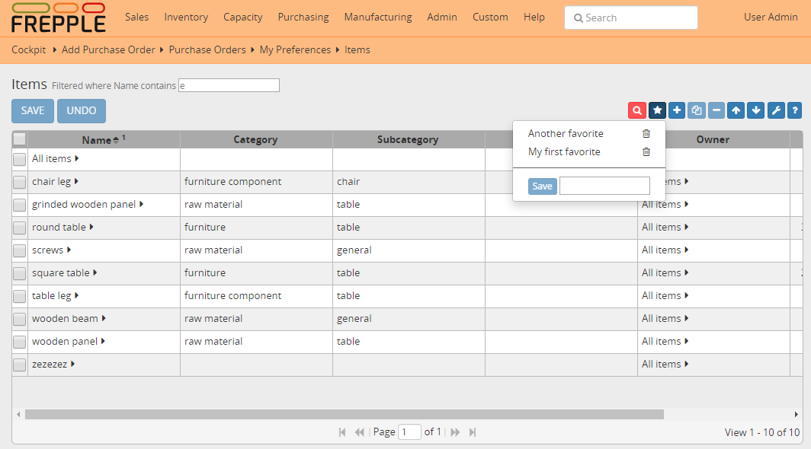

=========
Favorites
=========

All screens allow you to manage favorite settings with the star icon in
the tool bar on the upper left. This allows you to quickly jump back 
to frequently report settings, and can be huge time saver in your daily
workflows.

A favorite remembers the following information:
- filters
- sorting fields and direction
- displayed columns, their order and width
 
Favorites are private for each user.
 

   