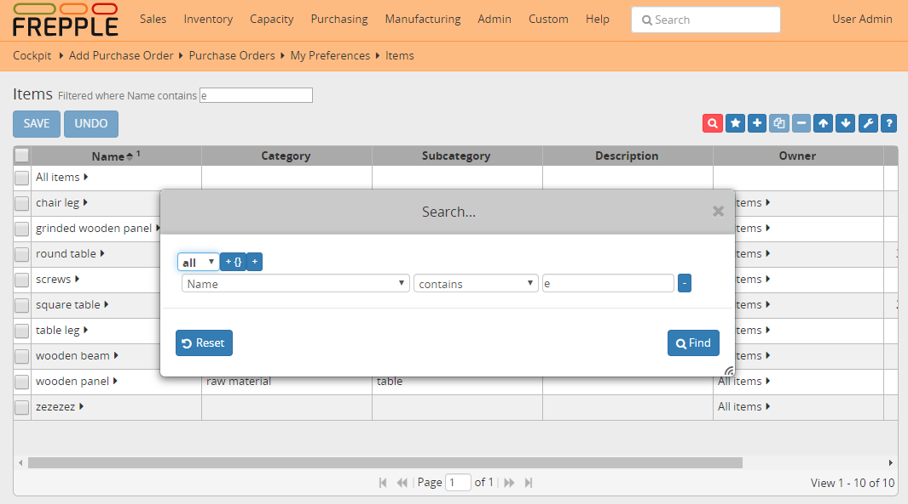

==============
Filtering data
==============

In all screens a filter can be defined with the search box displayed next
to the title.

- A search on a text field can be added by entering the search term
  in the input box, and then selecting the field where to search on.
  
- For more complex filters, you click on the search icon next to the
  input box. An rich expression editor pops up.
     
- | Existing values are displayed next to the title. Filter values can
    be edited, which allows quick re-filtering.
  | When the filter value is empty, that filter is inactivate.
 

   