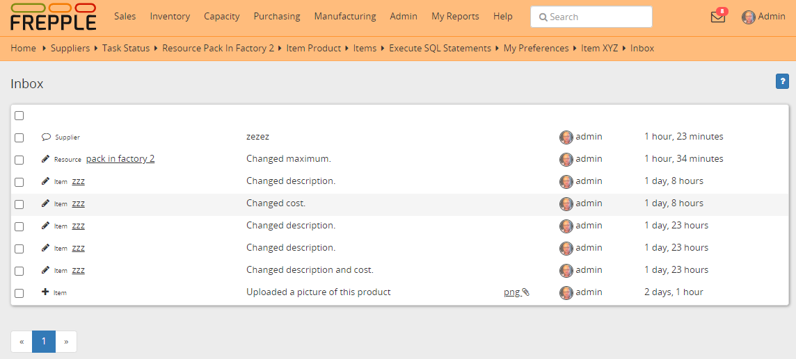

=====
Inbox
=====

The inbox shows messages about recent activity on objects you are following.
It allows you to efficiently collaborate with your colleagues on the plan.

First, you need to `follow objects <messages.html>`_. Whenever there is some
activity on that object you will get a message in your inbox.

