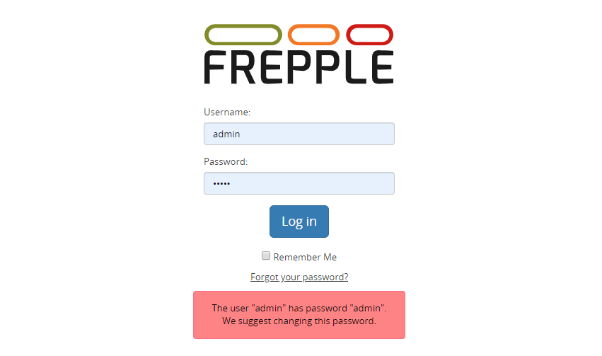

==========================
Logging in and logging out
==========================

You can log in using your user name or your email address.

A default user is created after installation: user name **admin** and
password **admin**.

.. Danger::
  For security reasons, it is highly recommended to change the password
  of this user.

Links to log out are provided in the user menu and in the upper right
corner, next to your user name.

| When the "remember me" box is checked, your user session session will be persisted
  in your browser after you close the browser window. You will only have to log in again 
  after some time of inactivity (3 days by default, configurable by an administrator with
  the setting SESSION_COOKIE_AGE).
| Security sensitive deployments should set this setting equal to 0, which disables this
  feature and forces users to log in for every browser session.

The "forgot your password" feature will send an email to reset your password. The
administrator will need to update the configuration with the connection details of an 
SMTP mail server for this feature to work.
