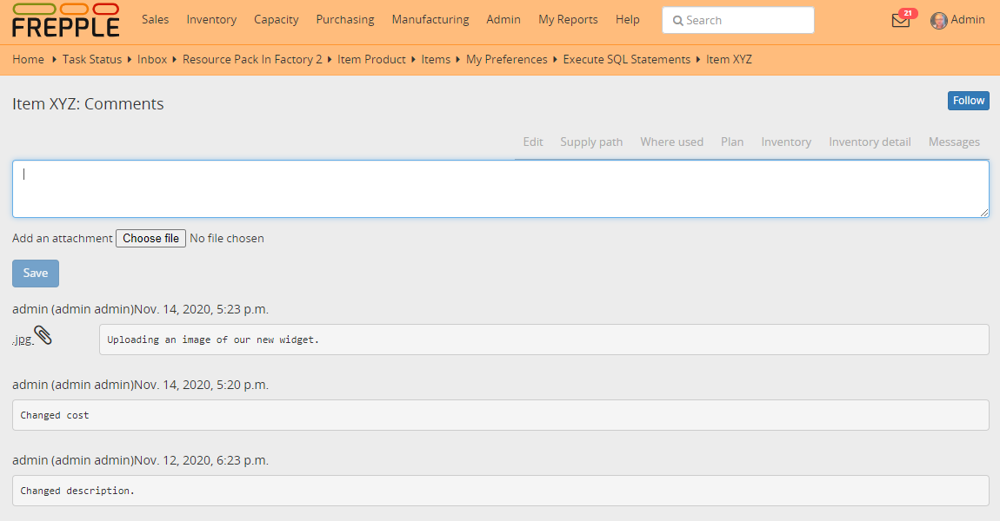

========
Messages
========

Each object has a message tab where you can:

- Click to "follow" button to get notifications in your `inbox <inbox.html>`_ 
  when there is activity on the object.

- Read and add comments.

- Upload attachments.

- See the change history of the object.

