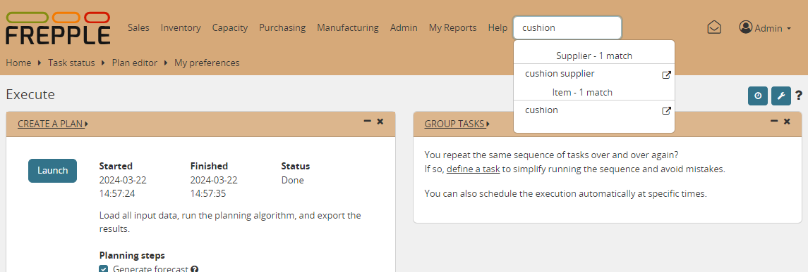

==========
Navigation
==========

Navigating the user interface is easy and intuitive.

* | **Menu bar**
  | Doesn't need explanation...
  | Screens to which you have no permissions will not be shown in the menu.
  | Worth also to mention that menus are dynamic. For example, Sales orders
    won't be displayed in the menus if you don't have at least one record in
    Item, Location and Customer tables.

* | **Jump search**
  | Enter 2 or more characters in the search box, and a list of matching
    objects is shown to you.

* | **Breadcrumbs**
  | The breadcrumbs allow you to navigate with a single click to a screen
    you visited before.

* | **Detail links**
  | The modelling objects have an triangular icon next to them. Clicking on
    it will open a screen with a selection of detailed reports on the
    object.

The screenshot below illustrates each of these methods.

