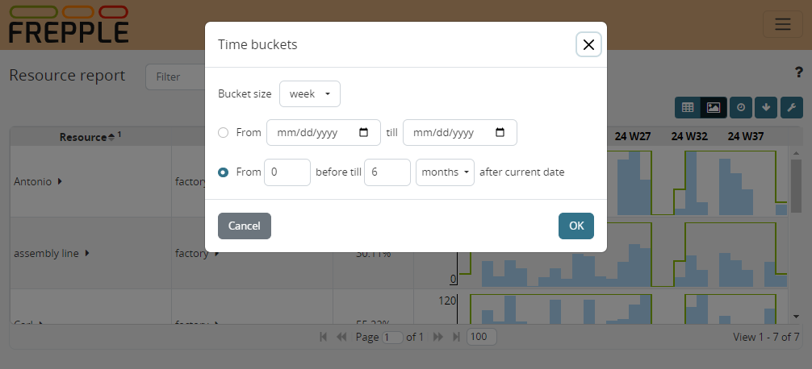

======================
Selecting time buckets
======================

A number of reports show results in a bucketized format. The buckets can be
selected using on the clock icon in the upper right corner.

The popup window allows you to define the horizon you want to report for:

*  | **The size of the report buckets**:
   | By default we create buckets for "days", "weeks", "months", "quarter"
     and "year".
   | Weeks are starting on Monday.
   | Months are calendar months, and a week thus spans across 2 months.

*  | The **start and end date of the horizon** can be specified in 2 ways:

     * As absolute dates.

     * | Relative to the current date.
       | The report horizon then always starts at the current date of the plan. This
         value is specified in the Parameter table as "currentdate", or is
         automatically set to the system clock if the parameter is absent or
         incorrectly formatted.
       | The end date of the reporting horizon is equal to the current date plus
         the specified offset. When the offset is specified in weeks or months, the
         end date is rounded up to the start date of the following week or month.
         This avoids reporting on partial buckets.

The settings you select are saved and will apply to all bucketized reports you
open.

.. Tip::

   An administrator can update the buckets by manipulating the records in the
   buckets and bucketdetail tables: In this way you can set up the buckets that are
   relevant for your organization, and also give the buckets the labels you prefer.
