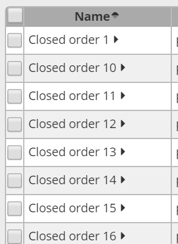

============
Sorting data
============

Clicking on a column header will sort the sort the data in ascending order.
Another click will sort in descending order. A third click deactivates
the sort.

You can sort on up to 3 fields simultaneously.

The sorting of a screen is automatically stored. When you reopen the same
report later on, it will open with the same sorting as when you left it.

