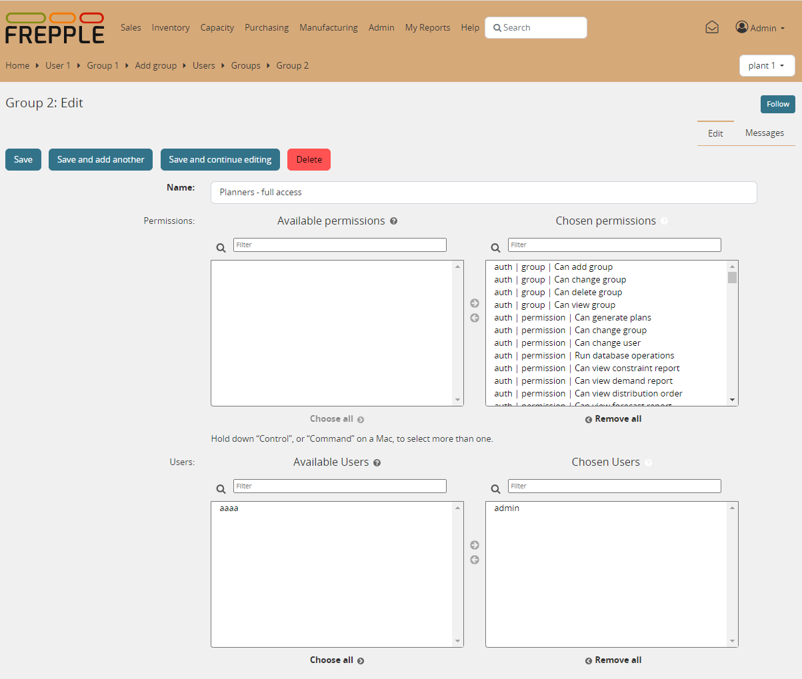

==========================
User permissions and roles
==========================

An administrator can create login accounts, set their password and permissions.

Groups are a generic way of categorizing users and apply permissions to those users.
A user in a group inherits all the permissions granted to that group.
A user can belong to any number of groups.

The user name, email, first name, last name, password are properties that are defined
system-wide.

The active flag, superuser flag, assigned groups and user permissions can
be defined per scenario. When the user is marked active in a scenario, the scenario
will appear in the dropdown list on the top right of the screen.

.. image:: ../_images/user.png
   :alt: User

