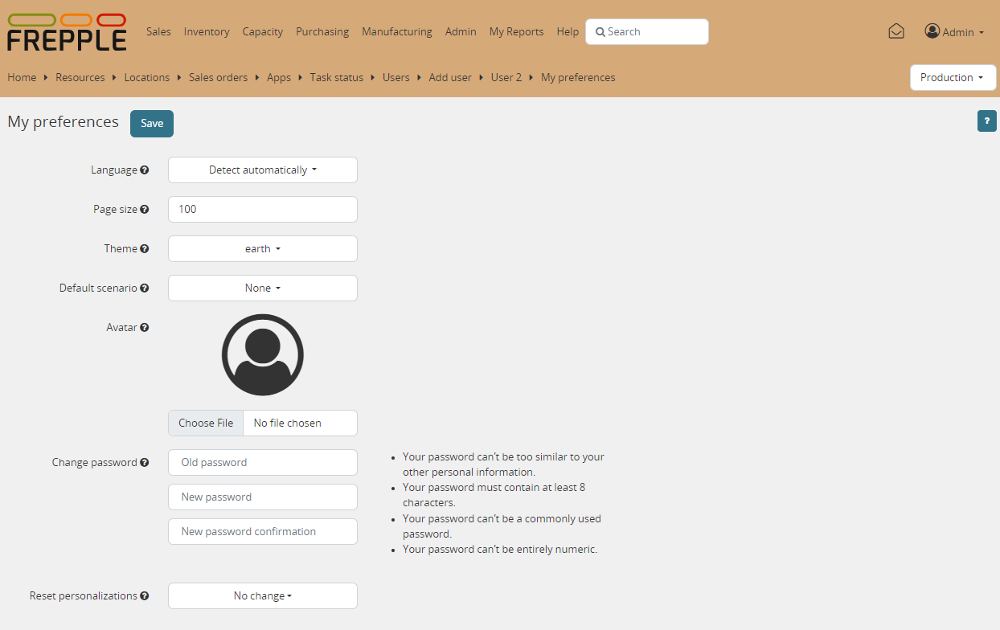

================
User preferences
================

For each user frePPle stores a number of personal settings and preferences.

* | **Language**:
  | Specifies the language of the user interface.
  | By default frePPLe will detect the preferred language of your web browser
    and use that.
  | You can override this and force a particular language.

* | **Page size**:
  | Number of records to fetch in a single page from the server.
  | The default value is 100. Values lower than 25 are not accepted.
  | Selecting a high value can slow down the display of the reports.

* | **Theme**:
  | Theme for the user interface.
  | If your system administrator has configured the system to support only
    a single theme (by editing the THEMES setting in the djangosettings.py
    file), this option will not be available to the users.

* | **Password**:
  | To change the password enter the current one and twice the new value.

