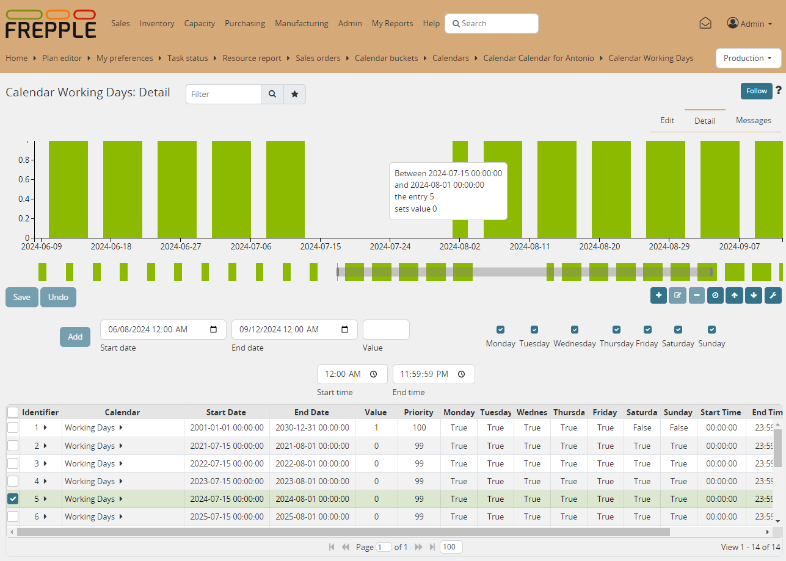

===============
Calendar detail
===============

The calendar detail screen visualizes how a :doc:`calendar <../../model-reference/calendars>`
varies over time. It also provides an intuitive and visual way of reviewing and
editing the :doc:`calendar buckets <../../model-reference/calendar-buckets>` that define the
values of the calendar.

The following rules define which calendar bucket is valid at a certain time:

* | A bucket is only valid from its "start date" (inclusive) till its "end
    date" (exclusive).
  | Outside of this date range a bucket is never selected.

* | If multiple bucket are effective on a date, the one with the lowest
    "priority" value is taken.
  | In case buckets have the same priority, the value of the bucket with the
    latest start date is selected.

* In case no bucket is effective on a certain date, the calendar will return
  the "default" value.

The calendar detail screen visualizes the resulting timeline of the calendar
and provides an easy way to update it. The following interactions are possible:

* | Hovering your mouse over the top graph displays a tooltip with information
    on the calendar bucket that is effective on that date.
  | That calendar bucket entry is also selected in the bottom table.

* | When you select one or more entries in the bottom table the graph highlights
    the periods when they are effective with a gray background.

* | You can add new calendar entries by filling out the form fields below the graph.
    The priority field is automatically set to assure your new entry overrides any
    existing records.

* | You can edit existing entries in the bottom table. The graph is updated once
    you save the new value.
