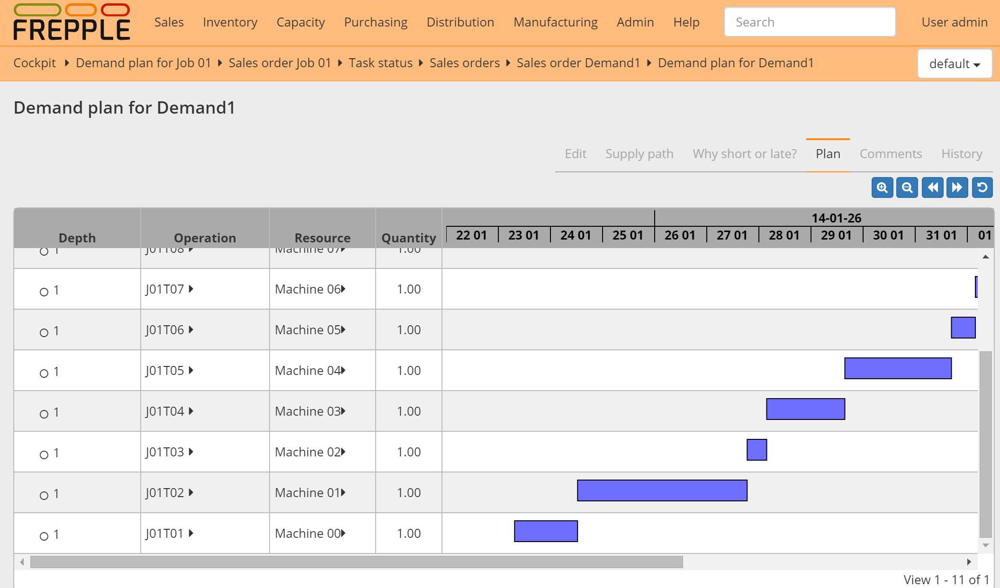

===================
Demand Gantt report
===================

This report shows a graphical representation of the complete plan of a certain demand. The plan show
all planned activities from raw material purchase orders, distribution orders between locations,
manufacturing operations, and also the delivery order to the customer.

In the Gantt chart the current date is marked as a black line, and the due date of the demand is
marked as a red line.

=================== ==============================================================================
Field               Description
=================== ==============================================================================
Depth               Depth of this operation in the supply path: 0 = delivery, and increases with
                    every level deeper in the bill of distribution and bill of material.
Operation           Operation being planned.
Type                Type of operation with possible values.

                    - MO: Manufacturing operation
                    - DO: Distribution operation
                    - PO: Purchase operation
                    - STCK: Inventory
                    - DLVR: Delivery to the customer

Item                Item being produced by this operation.
Item description    Description of the produced item.
Resource            Resource(s) being loaded.
Quantity required   | Quantity allocated to the demand.
                    | In the Gantt chart the operations are shown in detail. Some of the
                      operations may be only partly allocated to the demand being displayed.
Quantity confirmed  | Portion of the quantity required that is already in one of the statuses
                      "approved", "confirmed" or "completed".
                    | This is supply already in progress and execution.
Quantity proposed   | Portion of the quantity required that is still in the "proposed" status.
                    | This is supply not yet launched for execution.
=================== ==============================================================================

