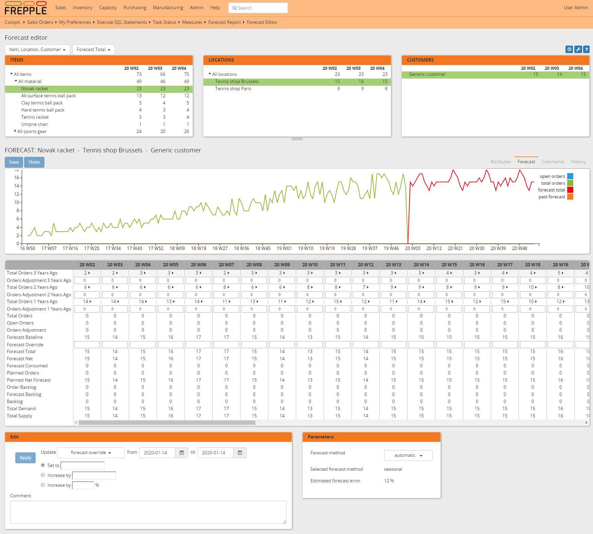

===============
Forecast editor
===============

The forecast editor provides a convenient way to review and edit forecast values.

The panel is split in two areas:

- | The top section of the screen allows easy navigation across the item, location,
    customer and time hierarchies. When an intersection is selected, the following
    dimensions and the bottom panel are immediately updated.
  | A first dropdown allows you to choose the order of the navigation dimensions.
    You can also choose to hide a dimension.
  | A second dropdown allows you choose which numbers should be displayed in the
    top panels.
  | The time buckets of the report can be configured with the clock icon.

  .. image:: ../_images/forecast-editor-top.png
     :alt: Forecast editor selection panels

- | The bottom of the screen has 4 tabs.
  | The Attributes tab will present additional information about the current selections of
    the top panels.
  | The Forecast tab displays the graphic of the selected forecast, a table where forecasts can be tunned (fields are
    described bellow), and a dropdown where the forecast method can be selected.
  | The Comments tab allows comments to be added for the currently selected Item, or Location, or Customer
    or Item-Location.
  | The History tab shows the changes that were made to the current selections.

  .. image:: ../_images/forecast-editor-tabAttributes.png
     :alt: Attributes of selections

  .. image:: ../_images/forecast-editor-tabForecast.png
     :alt: Forecast graph and table

  .. image:: ../_images/forecast-editor-tabComments.png
     :alt: Comments for selections

  .. image:: ../_images/ forecast-editor-tabHistory.png
     :alt: History of changes in selection

The table in the forecast tab is for forecast tunning. Adjustments can be made and will have
an immediate impact on the graph above the table.

Here is a description of the standard measures that are available on the forecast table. You can add
custom rows to the list as well by defining :doc:`../../model-reference/forecast-measures`.

========================== ==============================================================================
Field                      Description
========================== ==============================================================================
Total Orders               Quantity of orders in the time bucket, includes both open and closed
                           orders.
Total Orders Value         Value of orders in the time bucket, includes both open and closed
                           orders.
Open Orders                Quantity of open orders in the time bucket.
Open Orders Value          Value of open orders in the time bucket.
Orders Adjustment          | Manual adjustment added to the total order quantity.
                           | This adjustment can be applicable for a) removing exceptional demand
                             outliers from the demand history, or b) intializing the forecast for a new
                             product with the demand history of a similar, existing product.
                           | The forecast calculations add the order adjustment and the total orders
                             as the demand history input for the calculation.
Orders Adjustment Value    Value of the orders adjustment.
Forecast Baseline          Statistical forecast generated by the system.
Forecast Baseline Value    Value of the statistical forecast.
Forecast Override          | Manual adjustment of the forecast.
                           | If a value is entered in this row, it completely replaces the baseline
                             forecast proposed by the system.
Forecast Override Value    Value of the manual adjustment.
Forecast Total             The total forecast is equal to the forecast baseline, unless a forecast
                           override is specified.
Forecast Total Value       Value of the total forecast.
Forecast Net               Forecast quantity not yet consumed by orders.
Forecast Net Value         Value of the net forecast
Forecast Consumed          Forecast quantity already consumed by orders.
Forecast Consumed Value    Value of the consumed forecast.
Planned Orders             Quantity of orders planned in this time bucket.
Planned Orders Value       Value of the planned orders.
Planned Net Forecast       Quantity of net forecast planned in this time bucket.
Planned Net Forecast Value Value of net forecast planned in this time bucket.
Order Backlog              | Quantity of sales orders with a due date before the end of the bucket
                             that will be shipped late.
                           | This field is cumulative across all previous time buckets.
Order Backlog Value        | Value of the order backlog.
                           | This field is cumulative across all previous time buckets.
Forecast Backlog Value     | Quantity of the net forecast that will be shipped late.
                           | This field is cumulative across all previous time buckets.
Forecast Backlog Value     | Value of the forecast backlog.
                           | This field is cumulative across all previous time buckets.
Backlog                    | This is the sum of the order backlog and the forecast backlog.
                           | This field is cumulative across all previous time buckets.
Backlog value              | Value of the backlog.
                           | This field is cumulative across all previous time buckets.
Total Demand               Equal to the sum of the open orders and the net forecast.
Total Demand Value         Value of the total demand.
Total Supply               Equal to the sum of the planned orders and planned net forecast.
Total Supply Value         Equal to the sum of the planned orders and planned net forecast.
Past Forecast              | The total forecasted quantity for past periods. It allows a
                             forecast-versus-actual comparison that is important for reviewing and
                             measuring the forecast accuracy.
                           | The forecast snapshot for a certain past period was taken right before that
                             period became the current period.
========================== ==============================================================================

+--------------------------------+
| Related permissions            |
+================================+
| Can view forecast report       |
+--------------------------------+
| Can change forecast            |
+--------------------------------+