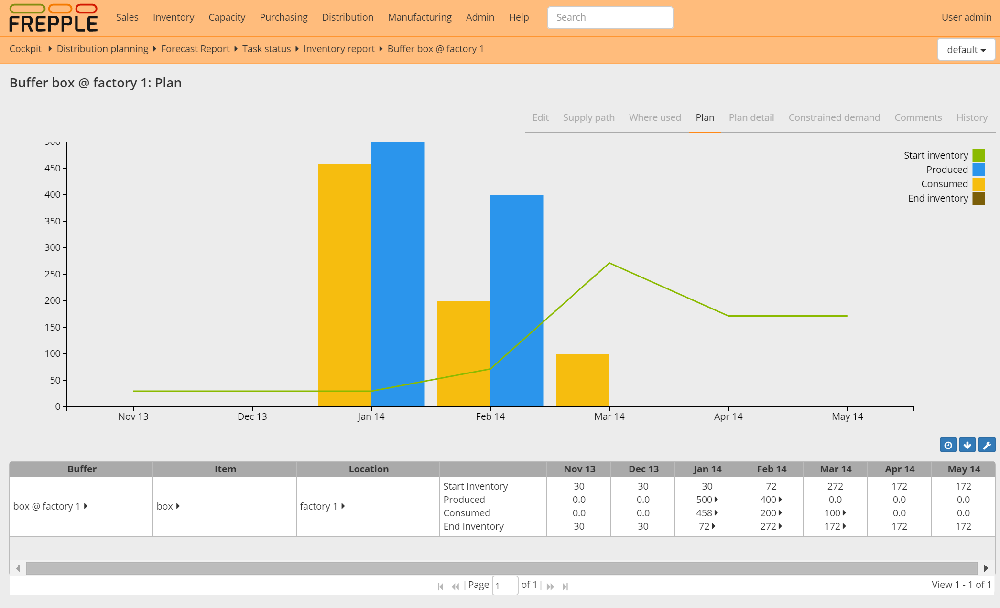
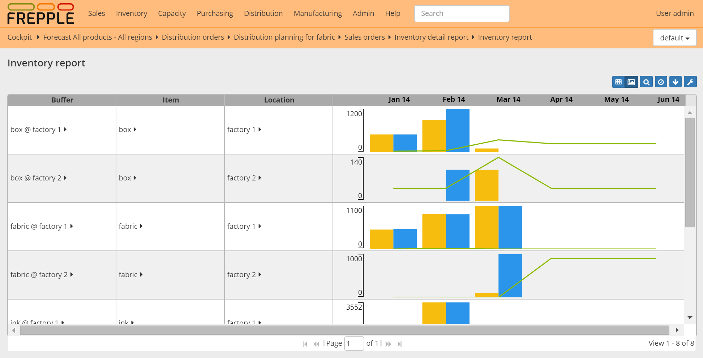
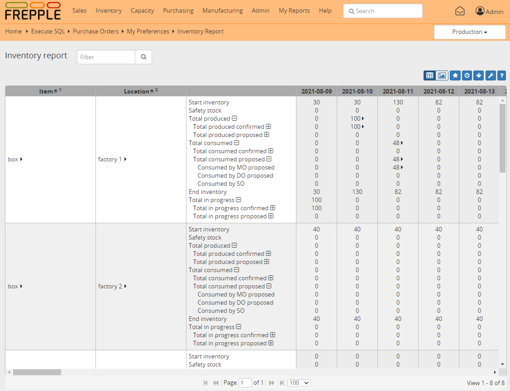

================
Inventory report
================

The report shows per buffer and per time bucket the inventory profile:
the starting inventory, the material consumed, the material produced and
the ending inventory.

If the report is opened for a single buffer an inventory graph is displayed.

| The rows in the report are defined such that following equations apply:
|   **End inventory = Start inventory + Total produced – Total consumed**
|   **Start inventory = End inventory of the previous time bucket**
|   **Total produced = Produced by MO + Produced by PO + Produced by DO**
|   **Total consumed = Consumed by MO + Consumed by DO + Consumed by SO**

============================== ==============================================================================
Field                          Description
============================== ==============================================================================
Item                           Item stored in the buffer.

Location                       Location of the buffer.

Start inventory                Inventory in the buffer at the start of the time bucket.

Start inventory days of cover  | Shows how many days of demand is covered with the starting inventory.
                               | In other words, it shows when will you run out of stock without new
                                 replenishments.

Safety stock                   The safety stock at the start of the time bucket.

Inventory status               | Represents the delay for unprotected buffers (community version or
                                 buffers without inventory policy) otherwise represents the buffer
                                 `inventory status <https://frepple.com/docs/current/user-interface/plan-analysis/inventory-status.php>`_

Total produced                 | Quantity replenished into the buffer during the time bucket.
                               | A drill down menu is available to see the detail of the supplying operations,
                                 and to see the demands the produced material is used for.

                               | Total produced = total produced confirmed + total produced proposed

Total produced confirmed       | Quantity produced into the buffer during the time bucket by confirmed and
                                 approved operations.

                               | Total produced confirmed = total produced by MO confirmed
                                 + total produced by PO confirmed
                                 + total produced by DO confirmed

Total produced proposed        | Quantity produced into the buffer during the time bucket by proposed operations.

                               | Total produced confirmed = total produced by MO proposed
                                 + total produced by PO proposed
                                 + total produced by DO proposed

Produced by MO                 | Displays the quantity replenished by manufacturing orders.

                               | Produced by MO = Produced by MO proposed + Produced by MO confirmed

Produced by MO confirmed       | Displays the quantity replenished by confirmed and approved manufacturing orders.

Produced by MO proposed        | Displays the quantity replenished by proposed manufacturing orders.

Produced by PO                 | Displays the quantity replenished by purchase orders.

                               | Produced by PO = Produced by PO proposed + Produced by PO confirmed

Produced by PO confirmed       | Displays the quantity replenished by confirmed and approved purchase orders.

Produced by PO proposed        | Displays the quantity replenished by proposed purchase orders.

Proposed ordering              | Displays the quantity of the proposed POs that need to be
                                 purchased in this time bucket.

Produced by DO                 | Displays the quantity replenished by distribution orders.

                               | Produced by DO = Produced by DO proposed + Produced by DO confirmed

Produced by DO confirmed       | Displays the quantity replenished by confirmed and approved distributrion orders.

Produced by DO proposed        | Displays the quantity replenished by proposed distributrion orders.

Total consumed                 | Quantity consumed from the buffer during the time bucket.
                               | A drill down menu is available to see the detail of the consuming operations,
                                 and to see the demands the consumed material is used for.

                               | Total consumed = total consumed confirmed + total consumed proposed

Total consumed confirmed       | Quantity consumed from the buffer during the time bucket by confirmed and
                                 approved operations.

                               | Total consumed confirmed = total consumed by MO confirmed
                                 + total consumed by PO confirmed
                                 + total consumed by DO confirmed

Total consumed proposed        | Quantity consumed from the buffer during the time bucket by proposed operations.

                               | Total consumed proposed = total consumed by MO proposed
                                 + total consumed by PO proposed
                                 + total consumed by DO proposed
                                 + consumed by SO

Consumed by MO                 | Displays the quantity consumed by manufacturing orders.

                               | Consumed by MO = consumed by MO proposed + consumed by MO confirmed

Consumed by MO proposed        | Displays the quantity consumed by proposed manufacturing orders.

Consumed by MO confirmed       | Displays the quantity consumed by confirmed & approved manufacturing orders.

Consumed by DO                 | Displays the quantity consumed by distribution orders.

                               | Consumed by DO = consumed by DO proposed + consumed by DO confirmed

Consumed by DO proposed        | Displays the quantity consumed by proposed distribution orders.

Consumed by DO confirmed       | Displays the quantity consumed by confirmed & approved distribution orders.

Consumed by SO                 | Displays the quantity consumed by sales orders.

Consumed by Fcst               | Displays the quantity consumed by forecast.

Net forecast                   | The net forecast for that time bucket.

Open sales orders              | The open sales orders with a due date in that time bucket.

Total demand                   | The total demand due in that time bucket.

                               | Total demand = Open sales orders + Net forecast.

Total in progress              | Sum of the manufacturing/purchase/distribution order quantities in progress.
                               | The shipping/starting date of the order must be before the end date
                               | of the time bucket and the receiving/enddate of the order must be after
                                 the end date of the time bucket to be considered in progress.

                               | Total in progress = Total in progress confirmed + Total in progress proposed

Total in progress confirmed    | Work in progress confirmed = Work in progress MO confirmed
                                 + In transit DO confirmed + On order PO confirmed

Total in progress proposed     | Work in progress proposed = Work in progress MO proposed
                                 + In transit DO proposed + On order PO proposed

Work in progress MO            | Sum of the manufacturing order quantities in progress in that time bucket.

                               | Work in progress MO = Work in progress MO confirmed
                                 + Work in progress MO proposed

Work in progress MO proposed   | Sum of the proposed manufacturing order quantities in progress in that time
                                 bucket.

Work in progress MO confirmed  | Sum of the confirmed and approved manufacturing order quantities in progress
                                 in that time bucket.

On order PO                    | Sum of the purchase order quantities on order in that time bucket.

                               | On order PO = On order PO confirmed + On order PO proposed

On order PO  confirmed         | Sum of the confirmed and approved purchase order quantities on order in that
                                 time bucket.

On order PO  proposed          | Sum of the proposed purchase order quantities on order in that
                                 time bucket.

In transit DO                  | Sum of the distribution order quantities in transit in that time bucket.

                               | In transit DO = In transit DO confirmed + In transit DO proposed

In transit DO confirmed        | Sum of the confirmed and approved distribution order quantities in transit
                                 in that time bucket.

In transit DO proposed         | Sum of the proposed distribution order quantities in transit in that time
                                 bucket.

End inventory                  | Inventory in the buffer at the end of the time bucket.
                               | A drill down menu is available to see the detail of the consuming and
                                 producing operations, and to see the demands the consumed material is used
                                 for.

Total backlog                  | The total quantity of demand due in the past that is still to be planned.

                               | Total backlog = Order backlog + Forecast backlog

Order backlog                  | The total quantity of sales orders due in the past that is still to be planned.

Forecast backlog               | The total quantity of forecast due in the past that is still to be planned.

============================== ==============================================================================

+--------------------------------+
| Related permissions            |
+================================+
| Can view inventory report      |
+--------------------------------+

