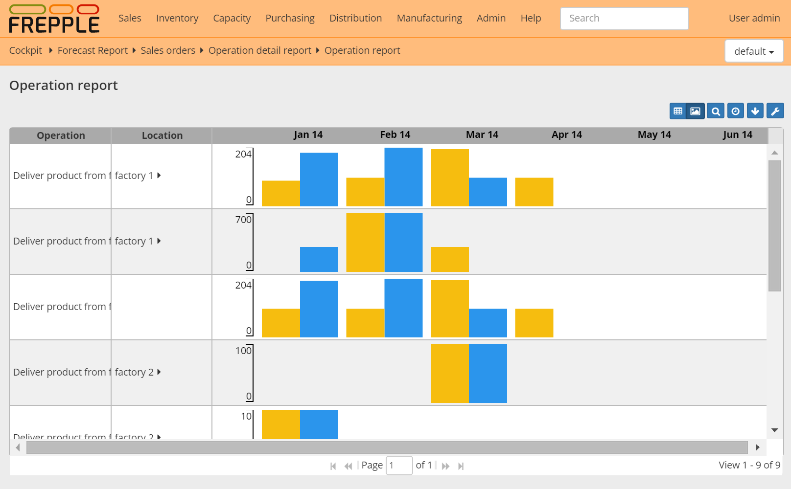

==================
Operations summary
==================

The report shows for each time bucket and each operation the quantity started
and finished. A drilldown report is also available to show the detailed data
as a list.

If the report is opened for a single operation a graph is displayed to visualize
the results.

In earlier releases this screen was called "Manufacturing Order Summary".

=================== ==============================================================================
Field               Description
=================== ==============================================================================
Operation           Name of the operation.
Location            Location of the operation.
Proposed starts     Sum of the quantity of all proposed manufacturing orders starting in this time
                    bucket.
Total starts        Sum of the quantity of all manufacturing or work orders starting in this time bucket.
Proposed ends       Sum of the quantity of all manufacturing or work orders ending in this time bucket.
Total ends          Sum of the quantity of all manufacturing or work orders starting in this time bucket.
Proposed production Proposed production in this bucket, where the produced quantity is assumed to
                    be evenly distributed between the start and end date of each manufacturing or work
                    order.
Total production    Total production in this bucket, where the produced quantity is assumed to
                    be evenly distributed between the start and end date of each manufacturing or work
                    order.
=================== ==============================================================================

+--------------------------------+
| Related permissions            |
+================================+
| Can view manufacturing order   |
+--------------------------------+

.. image:: ../_images/operation-report-single.png
   :alt: Operation report for a single operation

.. image:: ../_images/operation-report-table.png
   :alt: Operation report as a table
