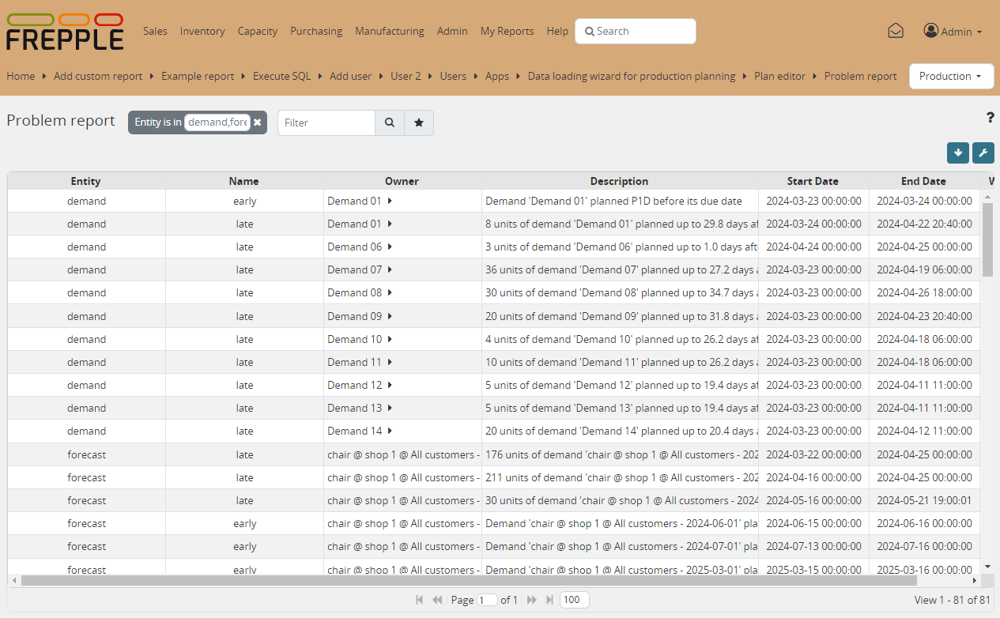

==============
Problem report
==============

This screen shows a list of issues requiring the planner’s attention.

Each entity type has its own set of exceptions:

* **Demand**:

  * | **invalid data**:
    | Some data problem prevents this object from being planned.

* **Resource**:

  * | **overload**:
    | A resource is being overloaded during a certain period of time.

* **Buffer**:

  * | **material shortage**:
    | A buffer is having a material shortage during a certain period of time.

  * | **invalid data**:
    | Flagged when a buffer has no ways of replenishment or too many.

* **Operation**:

  * | **precedence**:
    | Flagged when the sequence of two operations within a routing isn't respected.

* **Forecast**:

  * | **precedoutlierence**:
    | Flagged when the the demand in a period is abnormally high
      or low compared to the expected value.

============ ==============================================================================
Field        Description
============ ==============================================================================
name         Problem type.
description  Description of the problem.
start        Date at which the problem starts.
end          Date at which the problem ends.
============ ==============================================================================

+--------------------------------+
| Related permissions            |
+================================+
| Can view problem report        |
+--------------------------------+

