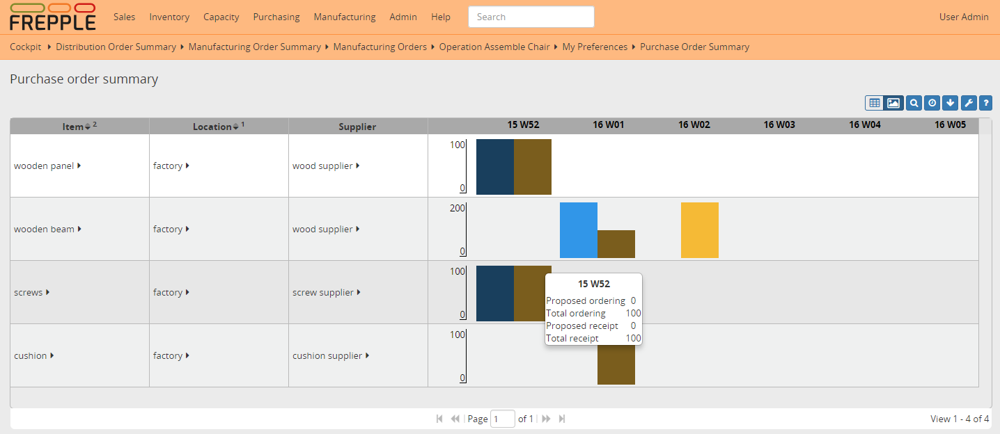
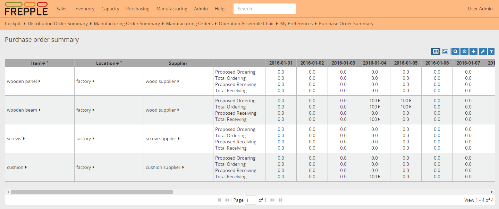

======================
Purchase order summary
======================

The report sumarizes the purchase for each item, location and supplier per time bucket. This 
report is typically used to provide a purchasing forecast to suppliers. 

A drilldown report is also available to show the detailed data as a list.

================== ==============================================================================
Field              Description
================== ==============================================================================
Item               Item being purchased.
Location           Location of the operation.
Supplier           Supplier we buy the item from.
Proposed ordering  Sum of the quantity of proposed purchase orders to be ordered in this time
                   bucket.
Total ordering     Sum of the quantity of all purchase orders to be ordered in this time bucket.
Proposed receiving Sum of the quantity of all proposed purchase orders being received in this
                   time bucket.
Total receiving    Sum of the quantity of all purchase orders being received in this time bucket.
Proposed on order  Sum of the quantity of all proposed purchase orders that are open at the end
                   of the time bucket.
Total on order     Sum of the quantity of all purchase orders that are open at the end of the
                   time bucket.
================== ==============================================================================

