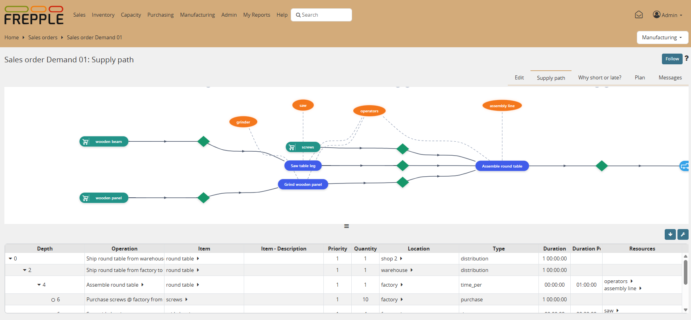

========================
Supply Path / Where Used
========================

This report follows the bill of material to show how a buffer is being
replenished. When called for a resource, it shows the operations using the
resource and their supply path.

The report can’t be called directly from the main menu, but it is accessed
from the context menus.

The report can follow the material flows in both directions:

* | The **supply path** report follows how material is produced or replenished.
  | It shows the path from end item upstream towards all raw materials required
    for the end item.

* | The **where-used** report follows how material is being consumed.
  | It shows the path from raw material downstream towards all end items using
    the material.

